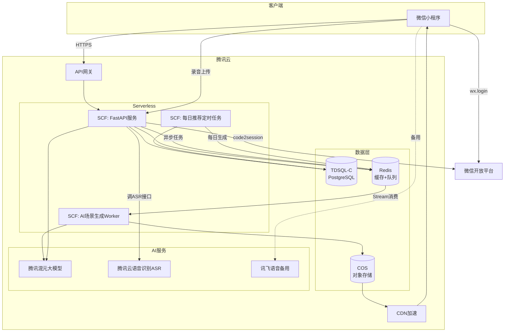
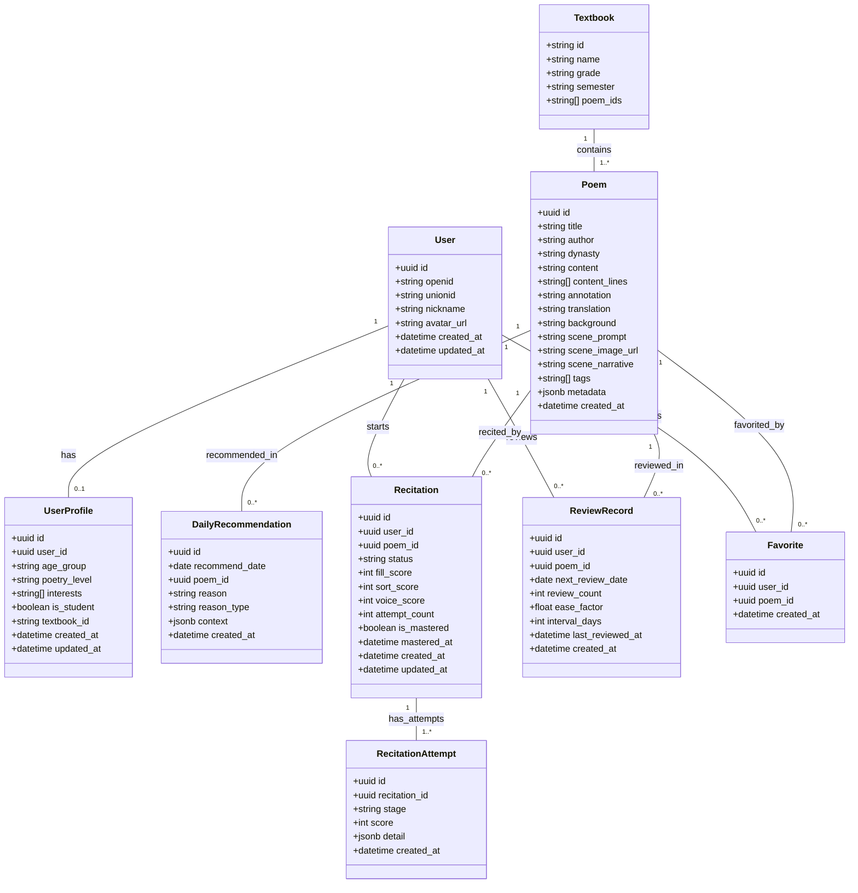
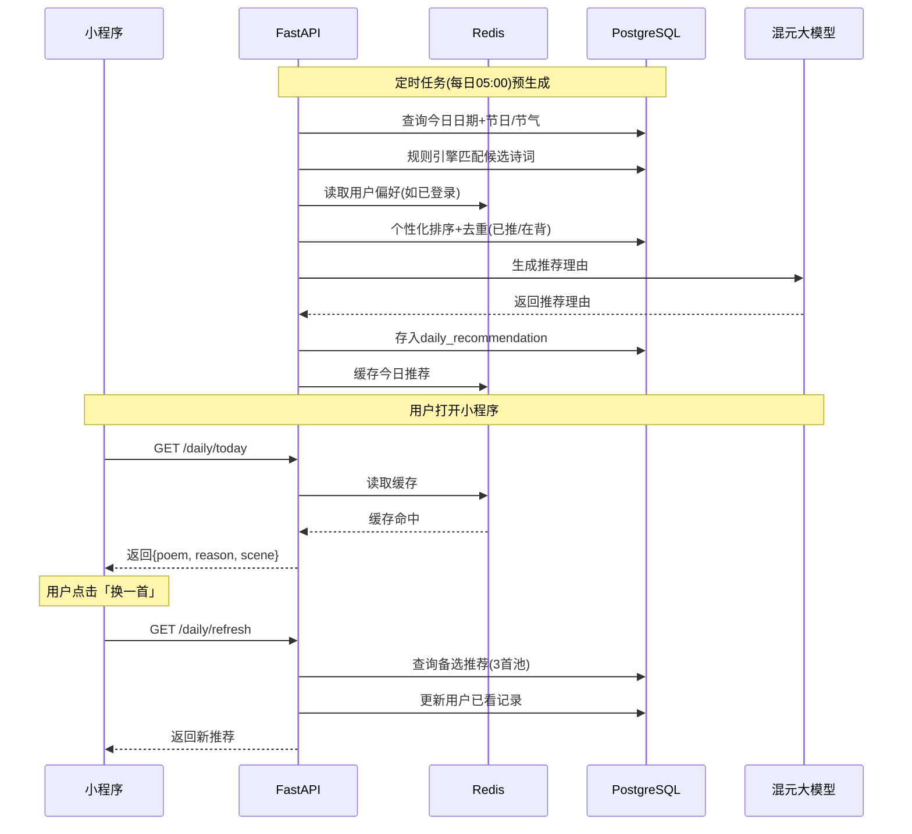
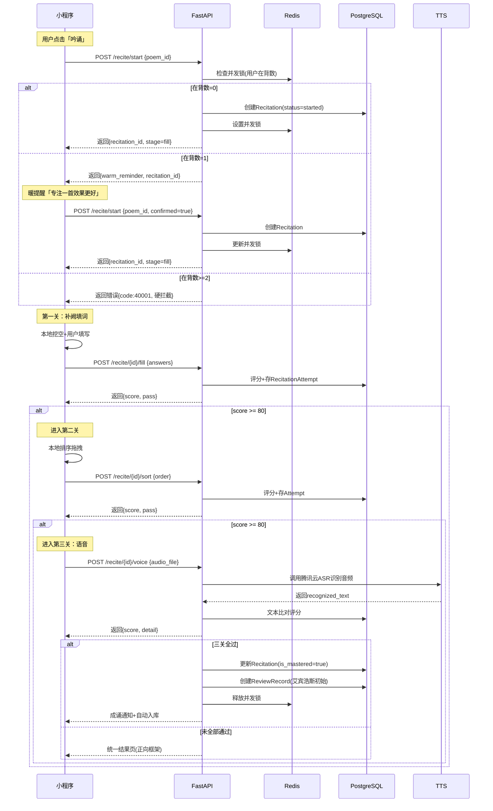
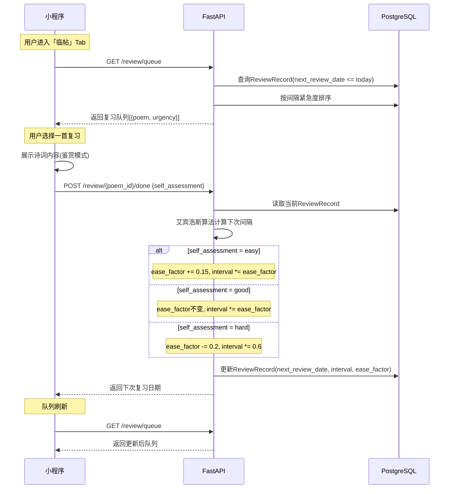
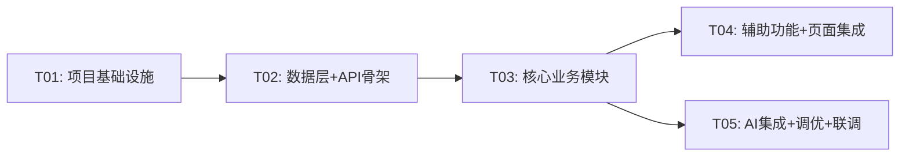

# 「每日背诗」技术架构设计文档

> 版本：v1.2（语音识别方案变更：插件→后端ASR）  
> 作者：架构师 高见远（Gao）  
> 日期：2026-06-09

---

## 目录

1. [实现方案与框架选型](#1-实现方案与框架选型)
2. [运行环境设计](#2-运行环境设计)
3. [云资源服务设计](#3-云资源服务设计)
4. [文件列表及相对路径](#4-文件列表及相对路径)
5. [数据结构和接口](#5-数据结构和接口)
6. [程序调用流程](#6-程序调用流程)
7. [任务列表](#7-任务列表)
8. [依赖包列表](#8-依赖包列表)
9. [共享知识](#9-共享知识)
10. [待明确事项](#10-待明确事项)

---

## 1. 实现方案与框架选型

### 1.1 前端框架：微信小程序原生开发

| 候选方案 | 优势 | 劣势 | 结论 |
|----------|------|------|------|
| **微信原生** | 零编译损耗、API直接调用（wx.createRecognizer等）、体积最小、性能最优 | 无法跨平台 | ✅ **选用** |
| Taro | 跨端 | 编译损耗、wx原生API适配滞后、包体积偏大 | ❌ |
| uni-app | 跨端+Vue生态 | 同上，且语音识别插件兼容性存疑 | ❌ |

**选型理由**：
1. 本项目强依赖微信原生能力：`wx.login` 鉴权、`wx.getRecorderManager` 录音、`wx.shareAppMessage` 分享——原生开发零适配成本。
2. 语音识别方案采用「前端录音 + 后端ASR」架构，不依赖任何微信插件（原同声传译插件已于2026年下架），后端调用腾讯云语音识别API。
2. 目标平台单一（仅微信小程序），跨端能力无需求。
3. 性能敏感：诗词渲染需精确断句排版、语音实时反馈，原生渲染链路最短。
4. 包体积敏感：小程序2MB主包限制，原生无框架运行时开销。

### 1.2 后端框架：Python (FastAPI)

| 候选方案 | 优势 | 劣势 | 结论 |
|----------|------|------|------|
| **FastAPI (Python)** | 异步高性能、自动OpenAPI文档、AI/ML生态极丰富（推荐算法+NLP）、开发效率高 | GIL限制CPU密集 | ✅ **选用** |
| Node.js (NestJS) | 异步IO强、微信生态工具链多 | AI/ML生态弱、推荐算法实现成本高 | ❌ |
| Go (Gin) | 极致性能 | AI/NLP生态极弱、开发效率低 | ❌ |

**选型理由**：
1. AI联想场景生成、推荐算法、语义匹配等核心功能依赖Python生态（LangChain / scikit-learn / sentence-transformers）。
2. FastAPI原生async/await + Pydantic类型校验，接口开发效率极高。
3. 微信后端鉴权（session_key解密）有成熟Python库（itsdangerous + cryptography）。
4. 语音评测评分逻辑涉及NLP处理，Python实现成本最低。

### 1.3 数据库选型

| 用途 | 选型 | 理由 |
|------|------|------|
| **主数据库** | PostgreSQL 15+ | JSONB存储诗词元数据灵活、全文搜索(tsvector)支持诗词检索、行级安全、扩展性优 |
| **缓存** | Redis 7+ | 每日推荐缓存、用户会话、复习队列排序、并发背诵锁、排行榜 |
| **对象存储** | 腾讯云COS | AI生成场景图片、分享卡片图片、用户头像 |

**不选MongoDB理由**：诗词数据结构相对固定，PostgreSQL的关系完整性+事务能力更适合背诵进度、复习记录等强一致性场景。

### 1.4 AI服务选型

| 功能 | 方案 | 理由 |
|------|------|------|
| **AI联想场景生成** | 腾讯混元大模型（文生文）+ 腾讯混元文生图 | 微信生态内调用、合规性优、延迟低 |
| **每日推荐算法** | 自建规则引擎 + 协同过滤（冷启动后） | 规则引擎覆盖日期/节日/课本匹配，协同过滤补充个性化 |
| **语音识别** | 腾讯云语音识别API（首选）+ 讯飞语音（备用） | 前端录音上传后端→调ASR返回文字，不依赖插件，架构更简洁 |
| **推荐理由生成** | 腾讯混元大模型 | 与场景生成共用模型，降低集成成本 |

### 1.5 消息队列

| 选型 | 用途 | 理由 |
|------|------|------|
| **Redis Stream** | AI场景生成异步任务、复习通知调度 | 初期规模无需Kafka/RabbitMQ，Redis Stream轻量够用 |

---

## 2. 运行环境设计

### 2.1 微信小程序运行时环境

```
微信小程序框架
├── 渲染层：WebView（诗词排版+交互）
├── 逻辑层：V8/JSCore（状态管理+业务逻辑）
├── 原生能力：
│   ├── wx.login（授权登录）
│   ├── wx.getRecorderManager（录音）
│   ├── wx.uploadFile（音频上传至后端）
│   ├── wx.shareAppMessage（分享）
│   └── wx.getSystemInfo（设备信息）
└── 存储：wx.setStorageSync（本地缓存，复习队列离线可用）
```

### 2.2 后端服务部署环境

**方案：腾讯云 Serverless + 容器混合**

| 组件 | 部署方式 | 理由 |
|------|---------|------|
| API服务 | **腾讯云SCF（云函数）** | 初期流量小、按量付费、免运维 |
| AI场景生成Worker | **腾讯云SCF** | 异步任务、弹性伸缩 |
| 定时任务（每日推荐生成） | **腾讯云SCF定时触发器** | 无需常驻进程 |
| Redis | **腾讯云Redis实例** | 托管服务、免运维 |
| PostgreSQL | **腾讯云TDSQL-C** | Serverless弹性、按量付费 |

> 成长期可平滑迁移至TKE（容器服务），FastAPI镜像零改动。

### 2.3 CI/CD 流水线

```
GitHub Push → GitHub Actions
├── Lint + Type Check (ruff/mypy, eslint)
├── Unit Tests (pytest, miniprogram-simulate)
├── Build
│   ├── 后端: Docker镜像构建 → 推送TCR
│   └── 前端: miniprogram-ci构建 → 微信体验版/正式版
├── Deploy
│   ├── 后端: SCF版本发布（灰度10%→100%）
│   └── 前端: 微信小程序提审
└── Notify (企业微信机器人)
```

---

## 3. 云资源服务设计

### 3.1 云服务商选型：腾讯云

**核心理由**：
1. 微信生态亲和性：SCF原生支持微信小程序云开发、TDSQL-C无缝对接、COS+CDN微信内加速。
2. 混元大模型API同平台调用，无跨云延迟。
3. 合规性：数据不出腾讯云，微信小程序审核友好。

### 3.2 云产品清单

| 产品 | 规格 | 用途 | 初期月费(估) | 成长期月费(估) |
|------|------|------|-------------|---------------|
| SCF (云函数) | 128MB×100万次/月 | API+定时任务 | ¥50 | ¥500 |
| TDSQL-C (PostgreSQL) | 1C2G Serverless | 主数据库 | ¥80 | ¥600 |
| Redis | 256MB标准版 | 缓存+队列 | ¥50 | ¥300 |
| COS (对象存储) | 标准50GB | 图片存储 | ¥10 | ¥200 |
| CDN | 100GB/月 | 图片加速 | ¥20 | ¥300 |
| API网关 | 共享实例 | 统一入口+限流 | ¥30 | ¥200 |
| 腾讯混元API | 按Token计费 | 场景生成+推荐理由 | ¥100 | ¥2000 |
| SSL证书 | 免费DV | HTTPS | ¥0 | ¥0 |
| **合计** | | | **~¥340/月** | **~¥4100/月** |

### 3.3 架构拓扑图



---

## 4. 文件列表及相对路径

### 4.1 前端项目结构（小程序）

```
miniprogram/
├── app.js                          # 小程序入口（全局状态、登录逻辑）
├── app.json                        # 全局配置（tabBar、pages、plugins）
├── app.wxss                        # 全局样式（设计Token变量）
├── project.config.json             # 项目配置
├── sitemap.json                    # 站点地图
│
├── components/                     # 公共组件
│   ├── poem-card/                  # 诗词卡片组件
│   │   ├── index.wxml
│   │   ├── index.wxss
│   │   ├── index.js
│   │   └── index.json
│   ├── poem-detail/                # 诗词详情展示（正文+注释+译文+背景）
│   │   ├── index.wxml
│   │   ├── index.wxss
│   │   ├── index.js
│   │   └── index.json
│   ├── action-bar/                 # 操作栏（另择/珍藏/吟诵）
│   │   ├── index.wxml
│   │   ├── index.wxss
│   │   ├── index.js
│   │   └── index.json
│   ├── recitation-guard/           # 背诵并发守卫弹窗
│   │   ├── index.wxml
│   │   ├── index.wxss
│   │   ├── index.js
│   │   └── index.json
│   ├── share-card/                 # 分享卡片生成
│   │   ├── index.wxml
│   │   ├── index.wxss
│   │   ├── index.js
│   │   └── index.json
│   └── loading/                    # 加载态组件
│       ├── index.wxml
│       ├── index.wxss
│       ├── index.js
│       └── index.json
│
├── pages/                          # 页面
│   ├── index/                      # Tab1: 首页（每日推荐）
│   │   ├── index.wxml
│   │   ├── index.wxss
│   │   ├── index.js
│   │   └── index.json
│   ├── poem/                       # 诗词鉴赏详情页
│   │   ├── index.wxml
│   │   ├── index.wxss
│   │   ├── index.js
│   │   └── index.json
│   ├── recite/                     # Tab2: 吟诵（背诵管理）
│   │   ├── index.wxml
│   │   ├── index.wxss
│   │   ├── index.js
│   │   └── index.json
│   ├── recite-check/               # 背诵检查页（三关流程）
│   │   ├── index.wxml
│   │   ├── index.wxss
│   │   ├── index.js
│   │   └── index.json
│   ├── recite-result/              # 背诵结果页（统一结果）
│   │   ├── index.wxml
│   │   ├── index.wxss
│   │   ├── index.js
│   │   └── index.json
│   ├── review/                     # 临帖（复习）
│   │   ├── index.wxml
│   │   ├── index.wxss
│   │   ├── index.js
│   │   └── index.json
│   ├── profile/                    # Tab3: 我的
│   │   ├── index.wxml
│   │   ├── index.wxss
│   │   ├── index.js
│   │   └── index.json
│   ├── onboarding/                 # 用户画像采集页
│   │   ├── index.wxml
│   │   ├── index.wxss
│   │   ├── index.js
│   │   └── index.json
│   ├── history/                    # 历史推荐页
│   │   ├── index.wxml
│   │   ├── index.wxss
│   │   ├── index.js
│   │   └── index.json
│   └── stats/                      # 背诵统计页
│       ├── index.wxml
│       ├── index.wxss
│       ├── index.js
│       └── index.json
│
├── services/                       # 服务层（API调用封装）
│   ├── api.js                      # HTTP请求基类（鉴权、重试、错误处理）
│   ├── auth.js                     # 登录鉴权服务
│   ├── poem.js                     # 诗词相关API
│   ├── recite.js                   # 背诵相关API
│   ├── review.js                   # 复习相关API
│   └── user.js                     # 用户画像API
│
├── stores/                         # 本地状态管理
│   ├── user-store.js               # 用户状态（登录态、画像）
│   ├── recite-store.js             # 背诵状态（在背列表、进度）
│   └── review-store.js             # 复习状态（今日复习队列）
│
├── utils/                          # 工具函数
│   ├── date.js                     # 日期/节日判断
│   ├── ebbinghaus.js               # 艾宾浩斯间隔算法
│   ├── score.js                    # 背诵评分算法
│   ├── format.js                   # 格式化工具
│   └── constants.js                # 常量定义
│
├── plugins/                        # （已废弃）原同声传译插件已下架，语音识别改用后端ASR
│
└── assets/                         # 静态资源
    ├── icons/                      # Tab图标
    └── images/                     # 占位图等
```

### 4.2 后端项目结构

```
backend/
├── main.py                         # FastAPI应用入口
├── requirements.txt                # Python依赖
├── Dockerfile                      # 容器构建
├── serverless.yml                  # SCF部署配置
│
├── core/                           # 核心配置
│   ├── config.py                   # 环境配置（Settings类）
│   ├── database.py                 # 数据库连接（SQLAlchemy async）
│   ├── redis.py                    # Redis连接
│   ├── security.py                 # 微信鉴权（session_key解密）
│   └── dependencies.py             # FastAPI依赖注入
│
├── models/                         # SQLAlchemy数据模型
│   ├── user.py                     # User / UserProfile
│   ├── poem.py                     # Poem / PoemAnnotation / PoemTranslation
│   ├── recitation.py               # Recitation / RecitationAttempt
│   ├── review.py                   # ReviewRecord
│   ├── daily.py                    # DailyRecommendation
│   └── base.py                     # Base模型（id/created_at/updated_at）
│
├── schemas/                        # Pydantic请求/响应模型
│   ├── user.py
│   ├── poem.py
│   ├── recitation.py
│   ├── review.py
│   └── common.py                   # 通用响应格式
│
├── api/                            # API路由
│   ├── v1/
│   │   ├── __init__.py
│   │   ├── auth.py                 # 登录鉴权
│   │   ├── user.py                 # 用户画像
│   │   ├── poem.py                 # 诗词内容
│   │   ├── daily.py                # 每日推荐
│   │   ├── recitation.py           # 背诵管理
│   │   ├── review.py               # 复习管理
│   │   └── share.py                # 分享
│   └── router.py                   # 路由汇总
│
├── services/                       # 业务逻辑层
│   ├── auth_service.py             # 微信登录+token管理
│   ├── recommend_service.py        # 推荐算法（规则+协同过滤）
│   ├── poem_service.py             # 诗词内容服务
│   ├── recite_service.py           # 背诵逻辑（三关+并发守卫）
│   ├── review_service.py           # 复习调度（艾宾浩斯）
│   ├── scene_service.py            # AI场景生成（调用混元）
│   └── share_service.py            # 分享卡片生成
│
├── workers/                        # 异步任务Worker
│   ├── scene_worker.py             # AI场景生成Worker
│   └── daily_worker.py             # 每日推荐预生成Worker
│
├── data/                           # 诗词数据库脚本
│   ├── seed_poems.py               # 诗词数据导入
│   ├── festivals.json              # 节日/节气配置
│   └── textbooks.json              # 课本绑定配置
│
└── tests/                          # 测试
    ├── conftest.py
    ├── test_auth.py
    ├── test_recommend.py
    ├── test_recite.py
    ├── test_review.py
    └── test_scene.py
```

### 4.3 共享配置

```
shared/
├── error-codes.json                # 错误码定义（前后端共用）
└── api-contracts.json              # API接口契约（前后端对齐）
```

---

## 5. 数据结构和接口

### 5.1 核心数据模型（Mermaid类图）



### 5.2 API接口列表

#### 5.2.1 鉴权模块

| 方法 | 路径 | 说明 |
|------|------|------|
| POST | `/api/v1/auth/login` | 微信code登录，返回token |
| POST | `/api/v1/auth/refresh` | 刷新token |

#### 5.2.2 用户模块

| 方法 | 路径 | 说明 |
|------|------|------|
| GET | `/api/v1/user/profile` | 获取用户画像 |
| POST | `/api/v1/user/profile` | 创建/更新用户画像 |
| PUT | `/api/v1/user/profile` | 修改画像（含课本绑定） |

#### 5.2.3 诗词模块

| 方法 | 路径 | 说明 |
|------|------|------|
| GET | `/api/v1/poems/{poem_id}` | 获取诗词详情（正文+注释+译文+背景） |
| GET | `/api/v1/poems/{poem_id}/scene` | 获取AI联想场景（图+文） |
| POST | `/api/v1/poems/{poem_id}/scene/generate` | 触发场景异步生成 |

#### 5.2.4 每日推荐模块

| 方法 | 路径 | 说明 |
|------|------|------|
| GET | `/api/v1/daily/today` | 获取今日推荐（含推荐理由） |
| GET | `/api/v1/daily/refresh` | 换一首（触发三刷新） |
| GET | `/api/v1/daily/history` | 历史推荐列表 |

#### 5.2.5 背诵模块

| 方法 | 路径 | 说明 |
|------|------|------|
| GET | `/api/v1/recite/list` | 在背列表 |
| POST | `/api/v1/recite/start` | 开始背诵（含并发守卫检查） |
| POST | `/api/v1/recite/{id}/fill` | 提交补阙填词结果 |
| POST | `/api/v1/recite/{id}/sort` | 提交排序归位结果 |
| POST | `/api/v1/recite/{id}/voice` | 提交语音背诵结果 |
| GET | `/api/v1/recite/{id}/result` | 获取背诵结果（统一结果页） |
| POST | `/api/v1/recite/{id}/abandon` | 放弃背诵 |

#### 5.2.6 复习模块

| 方法 | 路径 | 说明 |
|------|------|------|
| GET | `/api/v1/review/queue` | 今日复习队列 |
| POST | `/api/v1/review/{poem_id}/done` | 标记复习完成（触发间隔算法） |
| GET | `/api/v1/review/stats` | 复习统计 |

#### 5.2.7 珍藏模块

| 方法 | 路径 | 说明 |
|------|------|------|
| POST | `/api/v1/favorites/{poem_id}` | 珍藏 |
| DELETE | `/api/v1/favorites/{poem_id}` | 取消珍藏 |
| GET | `/api/v1/favorites` | 珍藏列表 |

#### 5.2.8 分享模块

| 方法 | 路径 | 说明 |
|------|------|------|
| POST | `/api/v1/share/card` | 生成分享卡片图 |

#### 5.2.9 统计模块

| 方法 | 路径 | 说明 |
|------|------|------|
| GET | `/api/v1/stats/summary` | 背诵统计概览 |

### 5.3 通用响应格式

```json
{
  "code": 0,
  "data": {},
  "message": "success"
}
```

错误响应：
```json
{
  "code": 40001,
  "data": null,
  "message": "背诵并发数已达上限"
}
```

---

## 6. 程序调用流程

### 6.1 每日推荐流程



### 6.2 背诵三关流程



### 6.3 复习调度流程



---

## 7. 任务列表

### 7.1 任务分解

| 任务ID | 任务名称 | 源文件 | 依赖 | 优先级 | 预估工作量 |
|--------|---------|--------|------|--------|-----------|
| T01 | 项目基础设施 | 见下方 | 无 | P0 | 2天 |
| T02 | 数据层+API骨架 | 见下方 | T01 | P0 | 3天 |
| T03 | 核心业务模块（推荐+背诵+复习） | 见下方 | T02 | P0 | 5天 |
| T04 | 辅助功能+页面集成 | 见下方 | T03 | P1 | 3天 |
| T05 | AI集成+调优+联调 | 见下方 | T03 | P0 | 3天 |

### T01: 项目基础设施

**源文件**：
- 后端：`backend/main.py`, `backend/requirements.txt`, `backend/Dockerfile`, `backend/serverless.yml`, `backend/core/config.py`, `backend/core/database.py`, `backend/core/redis.py`, `backend/core/security.py`, `backend/core/dependencies.py`, `backend/api/router.py`
- 前端：`miniprogram/app.js`, `miniprogram/app.json`, `miniprogram/app.wxss`, `miniprogram/project.config.json`, `miniprogram/sitemap.json`, `miniprogram/services/api.js`, `miniprogram/utils/constants.js`
- 共享：`shared/error-codes.json`, `shared/api-contracts.json`

**说明**：搭建前后端项目骨架，配置开发/生产环境，建立HTTP请求基类、错误码体系、鉴权拦截器。

### T02: 数据层+API骨架

**源文件**：
- 后端：`backend/models/base.py`, `backend/models/user.py`, `backend/models/poem.py`, `backend/models/recitation.py`, `backend/models/review.py`, `backend/models/daily.py`, `backend/schemas/common.py`, `backend/schemas/user.py`, `backend/schemas/poem.py`, `backend/schemas/recitation.py`, `backend/schemas/review.py`, `backend/api/v1/auth.py`, `backend/api/v1/user.py`, `backend/api/v1/poem.py`, `backend/api/v1/daily.py`, `backend/api/v1/recitation.py`, `backend/api/v1/review.py`
- 数据：`backend/data/festivals.json`, `backend/data/textbooks.json`, `backend/data/seed_poems.py`

**说明**：定义全部数据模型、Pydantic Schema、API路由骨架（返回mock数据）、数据库迁移脚本、诗词种子数据。

### T03: 核心业务模块（推荐+背诵+复习）

**源文件**：
- 后端：`backend/services/auth_service.py`, `backend/services/recommend_service.py`, `backend/services/poem_service.py`, `backend/services/recite_service.py`, `backend/services/review_service.py`, `backend/workers/daily_worker.py`, `backend/utils/ebbinghaus.py`（移至services内部）
- 前端：`miniprogram/services/auth.js`, `miniprogram/services/poem.js`, `miniprogram/services/recite.js`, `miniprogram/services/review.js`, `miniprogram/stores/user-store.js`, `miniprogram/stores/recite-store.js`, `miniprogram/stores/review-store.js`, `miniprogram/utils/ebbinghaus.js`, `miniprogram/utils/score.js`, `miniprogram/utils/date.js`
- 前端页面：`miniprogram/pages/index/`, `miniprogram/pages/poem/`, `miniprogram/pages/recite/`, `miniprogram/pages/recite-check/`, `miniprogram/pages/recite-result/`, `miniprogram/pages/review/`
- 前端组件：`miniprogram/components/poem-card/`, `miniprogram/components/poem-detail/`, `miniprogram/components/action-bar/`, `miniprogram/components/recitation-guard/`

**说明**：实现核心业务闭环——每日推荐→鉴赏→开始背诵→三关检查→成诵入库→复习调度。含并发守卫、评分算法、艾宾浩斯算法。

### T04: 辅助功能+页面集成

**源文件**：
- 前端页面：`miniprogram/pages/profile/`, `miniprogram/pages/onboarding/`, `miniprogram/pages/history/`, `miniprogram/pages/stats/`
- 前端组件：`miniprogram/components/share-card/`, `miniprogram/components/loading/`
- 前端服务：`miniprogram/services/user.js`
- 后端：`backend/services/share_service.py`, `backend/api/v1/share.py`, `backend/api/v1/favorites.py`

**说明**：用户画像采集/修改、珍藏功能、分享卡片生成、历史推荐、背诵统计、我的页面。

### T05: AI集成+调优+联调

**源文件**：
- 后端：`backend/services/scene_service.py`, `backend/workers/scene_worker.py`
- 后端AI相关：场景生成prompt模板、推荐理由prompt模板
- 前端：`miniprogram/pages/recite/recite.js`（录音+上传组件）
- 测试：`backend/tests/`

**说明**：集成腾讯混元大模型（AI场景生成+推荐理由）、腾讯云语音识别API（前端录音→后端ASR→文本比对评分）、讯飞备用方案。端到端联调+性能优化。

### 7.2 任务依赖图



---

## 8. 依赖包列表

### 8.1 前端依赖（小程序原生，无npm包管理）

| 依赖 | 版本 | 用途 |
|------|------|------|
| 微信小程序基础库 | >= 3.3.0 | 框架核心（支持wx.createRecognizer） |
| 腾讯云语音识别API | 最新 | 语音识别（录音上传→后端ASR→返回文字），每月5000次免费 |
| miniprogram-ci | ^1.9.0 | CI/CD构建上传 |

> 小程序原生开发不使用npm包管理，核心能力通过微信框架和插件提供。

### 8.2 后端依赖

```
# Web框架
fastapi==0.115.0
uvicorn[standard]==0.30.0
python-multipart==0.0.9

# 数据库
sqlalchemy[asyncio]==2.0.35
asyncpg==0.30.0
alembic==1.13.0

# Redis
redis[hiredis]==5.2.0

# 数据校验
pydantic==2.9.0
pydantic-settings==2.5.0

# 微信鉴权
httpx==0.27.0
itsdangerous==2.2.0
cryptography==43.0.0

# AI服务
tencentcloud-sdk-python-hunyuan==3.0.1200

# 图片处理
Pillow==10.4.0

# 工具
python-dateutil==2.9.0
loguru==0.7.0

# 测试
pytest==8.3.0
pytest-asyncio==0.24.0
httpx==0.27.0
```

---

## 9. 共享知识

### 9.1 命名规范

| 类别 | 规范 | 示例 |
|------|------|------|
| API路径 | kebab-case，复数名词 | `/api/v1/daily/today` |
| 数据库表名 | snake_case，复数 | `daily_recommendations` |
| 数据库字段 | snake_case | `next_review_date` |
| JSON字段 | camelCase | `nextReviewDate` |
| 前端变量 | camelCase | `poemList` |
| 前端常量 | UPPER_SNAKE_CASE | `MAX_CONCURRENT_RECITE` |
| 文件名 | kebab-case | `recite-service.js` |
| 小程序页面目录 | kebab-case | `pages/recite-check/` |
| 组件目录 | kebab-case | `components/poem-card/` |

### 9.2 错误码规范

| 错误码范围 | 含义 | 示例 |
|-----------|------|------|
| 0 | 成功 | — |
| 40001-40099 | 业务逻辑错误 | 40001=背诵并发超限 |
| 40101-40199 | 鉴权错误 | 40101=token过期 |
| 40401-40499 | 资源不存在 | 40401=诗词不存在 |
| 50001-50099 | 服务端错误 | 50001=AI服务调用失败 |

### 9.3 接口鉴权方案

1. **登录流程**：小程序 `wx.login` → 后端 `code2session` 获取 openid → 签发 JWT（有效期7天）+ Refresh Token（有效期30天）
2. **请求鉴权**：所有 `/api/v1/` 开头接口（除 `/auth/login` 外）需携带 `Authorization: Bearer <token>`
3. **Token刷新**：前端401拦截器自动调用 `/auth/refresh`，无感续期
4. **并发守卫**：基于Redis SET实现用户级分布式锁，key: `recite_lock:{user_id}`，TTL: 24h

### 9.4 跨端数据约定

- 所有日期字段使用 ISO 8601 UTC 格式：`2026-06-08T00:00:00Z`
- 诗词正文不跨行换行，按标点断句存储为 `content_lines: string[]`
- 分数统一 0-100 整数
- 艾宾浩斯参数：初始 ease_factor=2.5，最小 interval=1天

### 9.5 设计Token约定

```css
/* 全局CSS变量 */
--color-primary: #2D5A3D;      /* 松绿 */
--color-secondary: #C4A265;    /* 淡金 */
--color-accent: #C44536;       /* 朱砂 */
--color-warning: #BA7517;      /* 琥珀（错误标记） */
--color-bg: #FAF8F5;           /* 米白底 */
--color-text: #2C2C2C;         /* 主文字 */
--color-text-secondary: #8C8C8C; /* 辅助文字 */
```

---

## 10. 待明确事项

| 编号 | 事项 | 影响范围 | 决策结论 | 决策依据 |
|------|------|---------|---------|---------|
| Q01 | 诗词数据来源（自建 vs 第三方API） | 数据层、成本 | ✅ **自建+人工校对** | 质量可控，无API依赖，长期成本低 |
| Q02 | 腾讯混元大模型具体调用配额和并发限制 | AI场景生成 | ✅ **默认5QPS，上线后监控调整** | 初期DAU低，5QPS足够 |
| Q03 | 语音背诵评分标准细化（字级/句级/篇级） | 背诵评分 | ✅ **字级比对** | 精度最高，与UX正向框架（记对22字）完美匹配 |
| Q04 | 课本数据授权来源（人教版等版权） | 课本绑定功能 | ✅ **仅引用目录，不复制正文** | 零版权风险，目录引用属合理使用 |
| Q05 | 语音识别方案（插件已下架） | 语音背诵UX | ✅ **前端录音+后端腾讯云ASR** | 插件已下架，改用录音上传→后端识别→评分，架构更简洁 |
| Q06 | 分享卡片生成方式（前端Canvas vs 后端Puppeteer） | 分享功能 | ✅ **前端Canvas** | 无需后端渲染，离线可用，MVP够用 |
| Q07 | 冷启动阶段推荐策略（无用户画像时） | 推荐算法 | ✅ **按日期+节日** | 简单有效，有文化共鸣，无需用户画像 |
| Q08 | 复习队列离线支持范围 | 复习功能 | ✅ **仅缓存今日队列** | 轻量级，离线可复习，联网提交结果 |
| Q09 | 每日推荐「换一首」刷新次数上限 | 推荐功能 | ✅ **3次/天** | 够用且不刷爆推荐池 |
| Q10 | 背诵中途退出是否保存进度 | 背诵UX | ✅ **保存已过关卡** | 已通关不丢，下次从断点继续 |

> 以上10项已于 2026-06-09 由产品负责人确认，全部采用推荐默认值。

---

## 11. 2期扩展架构预留

### 11.1 运营管理后台架构

2期将新增独立运营管理后台（Admin Portal），与小程序共享数据层但独立部署。

| 维度 | 选型 | 说明 |
|------|------|------|
| 前端 | Vue3 + Element Plus | 独立SPA，Nginx反代 |
| 后端 | 复用FastAPI，新增 `/api/admin/v1/*` 路由 | 独立Admin JWT鉴权 |
| 鉴权 | Admin账号体系（非微信用户） | 账号密码+2FA |
| 部署 | 腾讯云CVM + Nginx | 需要常驻进程，不适合Serverless |

### 11.2 1期数据模型预留字段

| 模型 | 预留字段 | 2期用途 |
|------|---------|---------|
| Poem | `status: str = "active"` | 诗词状态管理（active/draft/audit_fail） |
| Poem | `audit_note: str \| None` | AI场景审核备注 |
| Poem | `source: str = "manual"` | 数据来源追溯 |
| DailyRecommendation | `is_pinned: bool = False` | 运营强制推荐 |
| DailyRecommendation | `pin_operator: str \| None` | 强推操作人 |
| User | `is_banned: bool = False` | 封禁标记 |
| User | `ban_reason: str \| None` | 封禁原因 |

### 11.3 2期新增数据模型（1期建表）

```python
class FeatureFlag:
    """功能开关/A-B实验"""
    id: uuid
    key: str                    # 开关key
    value: jsonb                # 配置值（含分桶、灰度比例等）
    description: str            # 说明
    created_at: datetime
    updated_at: datetime

class AuditLog:
    """运营操作审计日志"""
    id: uuid
    operator: str               # 操作人
    action: str                 # 操作类型
    target_type: str            # 操作对象类型
    target_id: uuid             # 操作对象ID
    detail: jsonb               # 变更详情
    created_at: datetime

class PushLog:
    """推送记录（2期Phase 2）"""
    id: uuid
    user_id: uuid
    template_id: str            # 消息模板ID
    content: jsonb              # 推送内容
    status: str                 # sending/sent/failed
    sent_at: datetime
```

### 11.4 1期事件埋点规范

1期在关键业务节点输出结构化日志，2期对接腾讯云CLS即可实现数据看板：

```python
# 统一使用structlog输出事件
logger.info("event_name",
    user_id=user.id,
    poem_id=poem.id,
    key_metric=value,
    timestamp=utc_now()
)
```

| 事件名 | 触发时机 | 关键指标 |
|--------|---------|---------|
| `app_launch` | 小程序启动 | is_cold_start, session_duration |
| `daily_recommend_shown` | 推荐页展示 | poem_id, is_first_view |
| `recite_started` | 开始背诵 | poem_id, concurrent_count |
| `recite_stage_completed` | 单关完成 | stage, score, is_passed |
| `recite_completed` | 三关完成 | total_score, is_mastered, time_spent |
| `review_done` | 复习完成 | poem_id, self_assessment, next_interval |
| `scene_generated` | AI场景生成 | poem_id, gen_time_ms, cost_yuan |
| `share_created` | 分享卡片生成 | poem_id, bg_type |

### 11.5 API路由扩展策略

```
/api/v1/*          → 1期：小程序端（微信JWT）
/api/admin/v1/*   → 2期：运营后台（Admin JWT，独立账号）
/api/internal/*    → 预留：内部服务调用（VPC内网，无需鉴权）
```

---

> 文档结束。架构师高见远出品。v1.1 更新：2期扩展架构预留。
