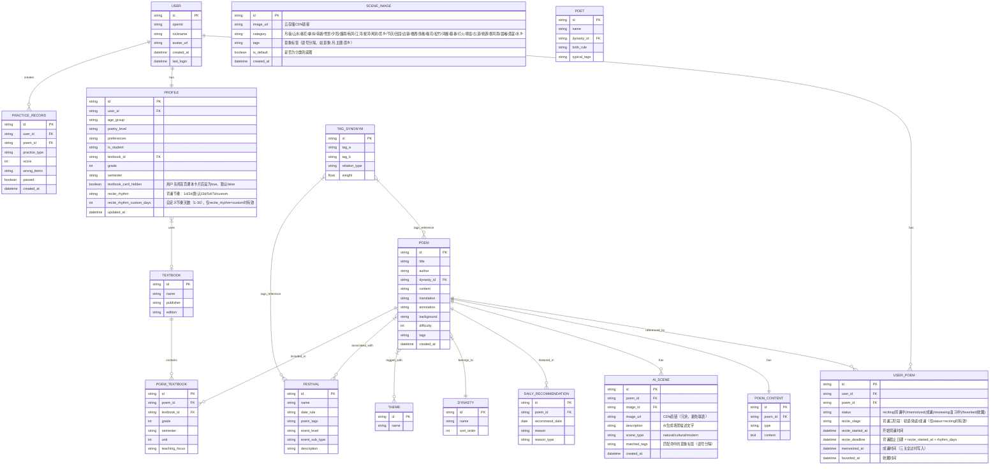

# 每日背诗 — 产品需求文档（PRD）

## 1. 产品概述

| 项目 | 内容 |
|------|------|
| 产品名称 | 每日背诗 |
| 产品形态 | 微信小程序 |
| 核心定位 | 基于日期/节日智能推荐的诗鉴赏与背诵工具：每日一诗纯鉴赏（零压力），用户自主控制背诵节奏 |
| 目标用户 | 文化爱好者、学生备考群体、亲子陪伴家长 |
| 核心价值 | 每天一首诗，让古诗与当下产生关联，通过AI联想场景和多维检查真正记住每一首诗 |

---

## 2. 功能清单

| 编号 | 功能模块 | 功能点 | 优先级 | 说明 |
|------|---------|--------|--------|------|
| F01 | 账户 | 微信授权登录 | P0 | 获取头像、昵称、openid |
| F02 | 账户 | 用户画像采集 | P0 | 年龄段+诗词水平+兴趣偏好+课本绑定 |
| F03 | 账户 | 画像修改 | P1 | 我的Tab-设置中修改画像 |
| F03a | 账户 | 课本绑定/修改/取消 | P0 | 首页课本卡片+首次登录画像采集，选择教材版本+年级+学期，可随时修改或取消绑定 |
| F04 | 推荐 | 每日一诗鉴赏 | P0 | **纯鉴赏定位**：每天推荐一首诗供零压力欣赏，与背诵完全解耦 |
| F04a | 推荐 | 换一首 | P0 | 不满意推荐时重新推荐，收集负反馈优化算法 |
| F05 | 推荐 | 推荐理由生成 | P0 | 展示"为什么推荐这首诗" |
| F06 | 推荐 | 历史推荐查看 | P1 | 左右滑动查看历史推荐诗 |
| F07 | 诗词内容 | 诗词正文展示 | P0 | 标题+作者+朝代+全文 |
| F08 | 诗词内容 | 注释展示 | P0 | 逐句注释 |
| F09 | 诗词内容 | 译文展示 | P0 | 白话文翻译 |
| F10 | 诗词内容 | 创作背景 | P0 | 故事化创作背景 |
| F11 | AI联想 | 联想场景生成 | P0 | AI生成契合诗词的真实世界场景（图+文） |
| F12 | AI联想 | 场景详情查看 | P0 | 场景大图+完整描述 |
| F13 | 背诵检查 | 默写填词 | P0 | 挖空关键字填词 |
| F14 | 背诵检查 | 顺序排列 | P0 | 打乱诗句排序还原 |
| F15 | 背诵检查 | 语音背诵 | P0 | 语音识别背诵判分，支持录音+实时转文字+逐字判分 |
| F16 | 背诵检查 | 判分与结果 | P0 | 实时判分+错题标记 |
| F17 | 背诵管理 | 吟诵（背诵入口） | P0 | 首页一级入口，展示当前背诵中诗词及进度 |
| F18 | 背诵管理 | 临帖（复习入口） | P0 | 首页一级入口，展示成诵后自动进入的复习队列 |
| F19 | 背诵管理 | 背诵节奏设置 | P0 | 用户设定背诵频率，5档预设+自定义，默认"每2天1首" |
| F20 | 背诵管理 | 吟诵智能入口 | P0 | 首页操作栏「吟诵」按钮合并「加入背诵」功能：未入队列→自动入+进练习，已在队列→直接进练习 |
| F21 | 背诵管理 | 并发背诵守卫 | P0 | 最多同时2首在"背诵中"，0→自由/1→暖提醒/2→硬拦截 |
| F22 | 背诵管理 | 背诵提醒 | P0 | 截止日期前1天小程序服务通知提醒，首页吟诵卡片显示倒计时警告 |
| F23 | 我的诗词库 | 已背过列表 | P0 | 通过检查的诗自动入库（诗词Tab-我的） |
| F24 | 我的诗词库 | 收藏功能 | P0 | 浏览时一键收藏 |
| F25 | 我的诗词库 | 分类筛选 | P1 | 按朝代/主题筛选 |
| F26 | 我的诗词库 | 搜索 | P1 | 按诗名/作者搜索 |
| F27 | 诗词库 | 全量浏览 | P0 | 按朝代/主题分类浏览（诗词Tab-全量） |
| F28 | 诗词库 | 搜索 | P0 | 全文搜索 |
| F29 | 分享 | 分享卡片生成 | P0 | 选诗+选背景+生成图片 |
| F30 | 分享 | 默认背景图 | P0 | 提供6张默认风景图 |
| F31 | 分享 | AI联想图作背景 | P0 | 可选AI联想场景图作背景 |
| F32 | 分享 | 自定义上传背景 | P1 | 用户上传图片作背景 |
| F33 | 分享 | 字体风格选择 | P1 | 至少2种字体风格 |
| F34 | 分享 | 分享到微信 | P0 | 好友/朋友圈 |
| F35 | 分享 | 保存到相册 | P0 | 下载图片到本地 |
| F36 | 个人中心 | 学习统计 | P1 | 背诵数/连续天数/总数（诗词Tab-统计） |
| F37 | 个人中心 | 背诵日历 | P1 | 日历视图标记背诵记录（诗词Tab-统计内跳转） |
| F38 | 个人中心 | 个人信息展示 | P1 | 头像/昵称/画像信息（我的Tab） |
| F39 | 个人中心 | 设置 | P1 | 画像修改/背诵节奏/通知/关于（我的Tab） |

### 优先级分布

| 优先级 | 数量 | 说明 |
|--------|------|------|
| P0（必须有） | 26 | MVP核心闭环：登录→画像+课本绑定→每日鉴赏→背诵节奏管理→吟诵（三关卡：补阙/排序/语音）→临帖→入库→分享 |
| P1（应该有） | 13 | 体验增强：历史推荐、筛选、统计、自定义背景 |
| P2（可以有） | 0 | 本期无 |

---

## 3. 详细功能说明

### F01 微信授权登录

| 项目 | 内容 |
|------|------|
| 描述 | 用户通过微信授权登录，获取头像、昵称、openid |
| 用户故事 | As a 新用户, I want to 用微信一键登录 so that 不需要额外注册就能使用 |
| 验收标准 | 1. 点击登录按钮弹出微信授权弹窗；2. 授权后获取头像+昵称+openid；3. 登录成功跳转画像采集页；4. 拒绝授权时提示需要授权才能使用 |
| 业务规则 | 必须授权才能使用；Token有效期7天；已登录用户自动跳过登录 |

### F02 用户画像采集

| 项目 | 内容 |
|------|------|
| 描述 | 首次登录后采集用户年龄段、诗词水平、兴趣偏好 |
| 用户故事 | As a 新用户, I want to 告诉系统我的水平 so that 推荐适合我的诗词 |
| 验收标准 | 1. 3步完成画像采集；2. 每步可选可不选（有默认值）；3. 完成后进入首页 |
| 业务规则 | 年龄段：少年(<18)/青年(18-35)/中年(>35)；水平：入门/进阶/精通（默认入门）；偏好：山水/边塞/田园/婉约/豪放/咏物（多选，默认全选）；**是否为学生：是→选择课本版本+年级（学期自动检测），否→跳过课本绑定** |

### F04 每日一诗鉴赏

| 项目 | 内容 |
|------|------|
| 描述 | 每天基于日期、节日、历史事件推荐一首诗，**纯鉴赏定位**——用户只需读诗欣赏，无任何背诵压力 |
| 用户故事 | As a 用户, I want to 每天收到一首推荐的诗词 so that 不用自己选也能读到好诗，轻松欣赏就好 |
| 验收标准 | 1. 进入首页自动展示今日推荐；2. 展示推荐理由；3. 展示完整诗词内容（含注释/译文/背景）；4. 展示AI联想场景；5. 操作栏「吟诵」按钮为智能入口（含副标题「点击开始背诵」降低认知门槛），未入队列时自动添加并进入练习（见F20）；6. 日期行下方展示淡色「不背也美，看看就好」零压力提示语（新用户前3天可见）；7. 诗词卡片底部有「▼ 查看注释译文」展开指示器 |
| 业务规则 | **v3.0 核心变更**：每天0:00更新推荐；每天仅1首推荐；已背过的诗不重复推荐；**每日一诗 ≠ 背诵任务**，纯为鉴赏消遣；操作栏「吟诵」按钮智能路由（副标题「点击开始背诵」）：未入队列→自动入+进练习，已在队列→直接进练习（见F20）；并发守卫在吟诵入口同样生效（见F21）；**v3.3 UX优化**：首页AI场景图下移至双入口卡片之后（降低首屏信息密度）；珍藏按钮升级为secondary样式；课本卡片仅is_student=yes时显示 |

### F04a 换一首

| 项目 | 内容 |
|------|------|
| 描述 | 用户对今日推荐不满意时，点击"另择"重新推荐另一首诗 |
| 用户故事 | As a 用户, I want to 另择推荐的诗词 so that 遇到不感兴趣的诗可以换到更合适的 |
| 验收标准 | 1. 推荐卡片上有"另择"按钮；2. 点击后**诗词正文+AI联想场景图+AI联想场景描述三者同步刷新**为新推荐内容（带动画过渡）；3. 当日最多换3次；4. 换掉的诗记入负反馈（不感兴趣），影响后续推荐权重 |
| 业务规则 | 每日上限3次另择；被换掉的诗7天内不再推荐给该用户；另择的候选池按同一推荐算法重新打分排序（排除已换掉的诗）；负反馈数据用于算法迭代优化；**另择为三联动刷新：诗词、场景图、场景描述作为一个整体替换，不允许诗词换了但场景图/描述未更新** |

### F11 AI联想场景生成

| 项目 | 内容 |
|------|------|
| 描述 | AI为每首诗生成一个契合的真实世界联想场景（图片+文字描述） |
| 用户故事 | As a 用户, I want to 看到与诗契合的场景 so that 能身临其境感受诗的意境 |
| 验收标准 | 1. 每首诗至少有1个AI联想场景；2. 场景包含图片+描述文字；3. 场景内容与诗词意境相关 |
| 业务规则 | 场景生成后缓存，同一首诗不重复调用AI；场景图片优先使用真实摄影作品风格；描述文字100-200字 |

### F13 默写填词（补阙）

| 项目 | 内容 |
|------|------|
| 描述 | 遮盖诗词关键字词，用户填写正确的字，系统逐字判分 |
| 用户故事 | As a 用户, I want to 通过填空的方式检验背诵 so that 找出哪些字记不住 |
| 验收标准 | 1. 展示诗词全文，关键字词挖空显示为下划线格位；2. 下方提供候选字池（含正确字+干扰字）；3. 点击候选字填入对应空位；4. 填满后自动判分，正确字标绿、错误字标红+显示正确答案；5. 可使用提示（显示首字，扣10%）；6. 得分≥80分通过当前关 |
| 业务规则 | 挖空比例20%-40%；关键实词优先（动词、形容词、意象词）；入门用户（poetry_level=beginner）偏少挖（20%）；每首诗最多3次提示 |

### F14 顺序排列

| 项目 | 内容 |
|------|------|
| 描述 | 打乱诗句顺序，用户拖拽还原为正确顺序 |
| 用户故事 | As a 用户, I want to 把打乱的诗句重新排列 so that 检验是否记住全诗顺序 |
| 验收标准 | 1. 展示打乱顺序的诗句卡片（可拖拽）；2. 拖拽排序后提交；3. 正确位置标绿、错误位置标红并显示正确位置；4. 全部正确才通过 |
| 业务规则 | 打乱策略：随机打乱但不把正确位置留给同一句；5句以下全量打乱；5句以上可选上下半阙分别打乱 |

### F15 语音背诵（再吟一次）

| 项目 | 内容 |
|------|------|
| 描述 | 用户对着手机朗读诗词，系统实时语音识别转文字，逐字比对判分 |
| 用户故事 | As a 用户, I want to 通过朗读的方式检验背诵 so that 像真正背诵一样检验记忆，比打字更自然 |
| 验收标准 | 1. 展示诗词标题+作者，正文不显示（防止照读）；2. 底部显示录音按钮（按住录音/松开结束，或点击开始/点击结束）；3. 录音中显示实时波形动画+录音时长；4. 录音结束后自动调用语音识别转文字；5. 识别文字与原文逐字比对，正确字标绿、错误/遗漏字标红；6. 显示匹配率得分，≥80分通过当前关；7. 识别失败（无语音/噪音过大）时提示"未检测到有效语音，请重试"；8. 支持"重新录音"按钮 |
| 业务规则 | 语音识别通道：微信小程序 `wx.createRecognizer()`（微信同声传译插件）为首选，备用讯飞语音识别API；识别语言：中文普通话（zh_CN）；生僻字容错：识别结果与原文比对时，使用拼音比对+常见同音字映射降低误判；录音时长上限：60秒/首（超长诗分句录音）；环境噪音过滤：识别置信度<0.5的单字标记为"模糊"，不直接判错；三次重试机会，取最高分 |

### F16 判分与结果

| 项目 | 内容 |
|------|------|
| 描述 | 三种练习方式的统一判分和结果展示 |
| 用户故事 | As a 用户, I want to 看到练习结果 so that 知道哪里错了、哪关通过了 |
| 验收标准 | 1. 统一结果页：得分+正确/错误/提示统计；2. 错题回顾：错误字词标琥珀色(#BA7517)+正确答案；3. 通过（≥80分）：显示🏆图标+绿色；4. 未通过：显示💪图标+鼓励文案；5. 语音背诵结果页使用正向框架：顶部显示「你记对了 X 个字！」+ 统计行使用「还可以更准确的 N 处」(琥珀■) +「漏读了 N 处」替代红色「错误N字」；6. 三关全过显示成诵庆祝+自动入库；7. 按钮：再来一次/返回首页 |
| 业务规则 | 补阙得分=正确填空字数/总填空字数×100；排序得分=正确位置句数/总句数×100；语音得分=正确识别字数/总字数×100；每关≥80分通过；三关全过→成诵→自动进入临帖复习队列 |

### F17 吟诵（背诵入口）

| 项目 | 内容 |
|------|------|
| 描述 | 首页一级入口卡片，与"临帖"并列展示，显示当前正在背诵的诗词列表及进度 |
| 用户故事 | As a 用户, I want to 在首页直接看到背诵进度 so that 清楚知道哪首诗在背、背到哪一步了 |
| 验收标准 | 1. 首页诗词鉴赏卡下方显示"吟诵"和"临帖"两个等大的入口卡片；2. "吟诵"卡片显示当前背诵中诗词（标题+作者+阶段进度条）；3. 无背诵中诗词时显示空状态引导；4. 点击"吟诵"卡片进入当前诗词的三关卡背诵练习；5. 右上角有⚙️图标可快速调整背诵节奏 |
| 业务规则 | 最多同时显示2首背诵中诗词（见F21并发守卫）；背诵中诗词按recite_started_at升序排列；吟诵卡片上若距截止日期≤1天则显示倒计时警告标签 |

### F18 临帖（复习入口）

| 项目 | 内容 |
|------|------|
| 描述 | 首页一级入口卡片，展示成诵后自动进入的复习队列，已从背诵子流程中提升为独立模块 |
| 用户故事 | As a 用户, I want to 有一个独立的复习入口 so that 成诵后的诗可以持续巩固 |
| 验收标准 | 1. 首页与"吟诵"卡片并列展示"临帖"卡片（副标题「复习已背过的诗」降低认知门槛）；2. 显示成诵后自动进入复习队列的诗（标题+作者+成诵时间）；3. 点击可进入复习练习（补阙/排序）；4. 无复习诗词时显示空状态 |
| 业务规则 | 成诵（三关卡全部通过）的诗自动进入临帖复习队列；复习队列无上限；用户可手动移出 |

### F19 背诵节奏设置

| 项目 | 内容 |
|------|------|
| 描述 | 用户设定背诵频率，控制系统计算每首诗的背诵截止日期 |
| 用户故事 | As a 用户, I want to 自己设定几天背一首 so that 按自己的节奏来，不会有每天必须背新诗的压力 |
| 验收标准 | 1. 提供5档预设：每天1首/每2天1首/每3天1首/每5天1首/每7天1首；2. 支持自定义天数（1-30天）；3. 首页吟诵卡片右上角有⚙️图标，点击弹出底部弹窗快速修改；4. "我的→设置"中也可修改；5. 新用户默认"每2天1首"；6. 修改节奏后自动重新计算当前背诵中诗词的截止日期 |
| 业务规则 | 节奏值存储于 PROFILE.recite_rhythm（枚举："1d"/"2d"(默认)/"3d"/"5d"/"7d"/"custom"）和 PROFILE.recite_rhythm_custom_days；截止日期计算规则：recite_deadline = recite_started_at + recite_rhythm_days |

### F20 吟诵智能入口

| 项目 | 内容 |
|------|------|
| 描述 | 首页操作栏「吟诵」按钮为智能入口，合并原「加入背诵」功能，一键完成入队列+进练习 |
| 用户故事 | As a 用户, I want to 点一个按钮就能开始背诗 so that 不用分两步先加入再练习 |
| 验收标准 | 1. 操作栏3个按钮：另择/珍藏（secondary样式）/吟诵（主CTA+副标题「点击开始背诵」）；2. 点击「吟诵」时：诗未在背诵队列→自动创建USER_POEM(reciting/初读)+进入模式选择页；3. 诗已在背诵队列→直接进入模式选择页；4. 点击前先检查并发守卫（见F21），满2首弹守卫弹窗；5. 吟诵卡片空态保留「选诗入吟」CTA，供浏览式添加场景 |
| 业务规则 | 智能路由逻辑：(1) 查询当前诗是否在队列→否→创建记录并跳转；(2) 是→直接跳转；(3) 满载→弹守卫；原「加入背诵」按钮已从操作栏移除，功能由吟诵智能入口隐式承担

### F21 并发背诵守卫

| 项目 | 内容 |
|------|------|
| 描述 | 限制用户同时背诵的诗词数量，防止贪多嚼不烂 |
| 用户故事 | As a 用户, I want to 被提醒不要同时背太多 so that 系统帮我量力而行 |
| 验收标准 | 1. 查询当前recite_status=reciting的诗词数N；2. N=0：自由添加，无提示；3. N=1：弹窗暖提醒「先把这首背熟再加新的吧」，标题「专注一首效果更好」，按钮[继续背这首] [我了解，仍要添加]；4. N=2：硬拦截，提示"当前已有2首诗在吟诵中，请先完成一首再添加新诗"，仅[知道了]按钮 |
| 业务规则 | 最大并发数=2（硬上限）；守卫检查在所有添加入口生效：吟诵智能入口(F20)、吟诵卡片空态「选诗入吟」、诗词库选诗背诵；N=1的暖提醒中用户选择"仍要添加"后允许添加至第2首 |

### F22 背诵提醒

| 项目 | 内容 |
|------|------|
| 描述 | 截止日期临近时通过小程序服务通知提醒用户，首页卡片也显示视觉警告 |
| 用户故事 | As a 用户, I want to 在快到期时收到提醒 so that 不会忘记完成背诵 |
| 验收标准 | 1. 截止日期前1天（含当天），发送小程序订阅消息提醒"「{诗名}」背诵截止还有{N}天，加油！"；2. 首页吟诵卡片上显示倒计时标签（如"剩余1天"），标签颜色为朱砂色；3. 超过截止日期未完成，标签变为"已超期"，仍可继续完成（不强制失败）；4. 成诵后自动清除提醒状态 |
| 业务规则 | 提醒通道：微信小程序订阅消息（用户需先授权）；提醒时机：每日上午10:00检查一次，距deadline≤1天触发；视觉警告优先级高于文字信息；超期后诗词仍保留在背诵中，不自动移除 |

| 项目 | 内容 |
|------|------|
| 描述 | 挖空诗词中关键字词，用户填写，提交后判分 |
| 用户故事 | As a 用户, I want to 通过默写填词检查背诵 so that 验证我真的记住了 |
| 验收标准 | 1. 诗词关键位置挖空显示输入框；2. 输入后可提交判分；3. 正确绿色标✓，错误红色标✗；4. 80分以上通过 |
| 业务规则 | 挖空比例20%-40%；关键实词优先挖空；可使用提示（扣10%/次，最多3次）；大小写不敏感 |

### F23 已背过列表

| 项目 | 内容 |
|------|------|
| 描述 | 三关卡全部通过的诗自动标记为成诵，并自动进入临帖复习队列 |
| 用户故事 | As a 用户, I want to 看到我背过的所有诗 so that 有成就感和进度追踪 |
| 验收标准 | 1. 三关卡全部通过后自动添加；2. 按成诵时间倒序排列；3. 可移除/重新练习/生成卡片 |
| 业务规则 | 通过标准：三关卡（初读→熟读→成诵）全部得分≥80分；成诵后USER_POEM.recite_status=memorized，自动进入临帖复习队列；移除后可重新背诵入库；重复通过不重复添加 |

### F23 分享卡片生成

| 项目 | 内容 |
|------|------|
| 描述 | 选择诗词和背景，生成精美诗词卡片用于分享 |
| 用户故事 | As a 用户, I want to 生成带诗词的精美卡片 so that 分享给朋友或在朋友圈展示 |
| 验收标准 | 1. 可选择诗词+背景+字体；2. 实时预览卡片效果；3. 一键生成图片；4. 支持分享/保存 |
| 业务规则 | 卡片尺寸750×1334px；右下角品牌水印；自定义图片需内容安全审核；生成时间<2秒 |

---

## 4. 推荐算法设计

### 4.1 算法框架

推荐算法根据用户是否绑定课本，使用**动态权重配置**：

```
# 无课本绑定（成人/非学生用户）
最终推荐分 = 事件匹配度 × 0.4 + 画像匹配度 × 0.3 + 难度匹配度 × 0.2 + 随机因子 × 0.1

# 有课本绑定（学生用户）
最终推荐分 = 事件匹配度 × 0.35 + 画像匹配度 × 0.25 + 课标匹配度 × 0.2 + 难度匹配度 × 0.15 + 随机因子 × 0.05
```

**设计原则**：
- 有课本时，课标匹配度权重0.2，仅次于事件匹配度——确保"今日事件关联+课内诗词"的组合优先
- 事件匹配度仍为最高权重（0.35），保证"当天有什么事"仍是推荐的第一驱动力
- 随机因子大幅降低（0.05），因为课本诗词池已经缩小，不需要太多随机探索

### 4.2 各维度定义

#### 无课本绑定

| 维度 | 权重 | 计算方式 | 数据来源 |
|------|------|---------|---------|
| 事件匹配度 | 0.4 | 当日事件标签与诗词标签的交集匹配比例 | 事件库+诗词标签+同义词表 |
| 画像匹配度 | 0.3 | 用户偏好标签与诗词主题标签的重合度 | 用户画像+诗词标签+同义词表 |
| 难度匹配度 | 0.2 | 用户水平层级与诗词难度层级的匹配度 | 用户画像+诗词难度 |
| 随机因子 | 0.1 | 0-1随机数，保证多样性 | 随机生成 |

#### 有课本绑定

| 维度 | 权重 | 计算方式 | 数据来源 |
|------|------|---------|---------|
| 事件匹配度 | 0.35 | 当日事件标签与诗词标签的交集匹配比例 | 事件库+诗词标签+同义词表 |
| 画像匹配度 | 0.25 | 用户偏好标签与诗词主题标签的重合度 | 用户画像+诗词标签+同义词表 |
| **课标匹配度** | **0.2** | 诗词是否在用户当前课本年级学期内 | 课本关联表+用户课本信息 |
| 难度匹配度 | 0.15 | 用户水平层级与诗词难度层级的匹配度 | 用户画像+诗词难度 |
| 随机因子 | 0.05 | 0-1随机数，保证多样性 | 随机生成 |

### 4.3 标签体系

#### 4.3.1 标签分类

诗词标签分为三类，入库时同时生成：

| 标签类别 | 说明 | 示例 | 数量 |
|----------|------|------|------|
| 意象标签 | 诗词中出现的具体物象 | 月、春雨、长江、柳、梅花 | 每首2-5个 |
| 主题标签 | 诗词表达的情感/主题 | 思乡、爱国、送别、田园、边塞 | 每首1-3个 |
| 场景标签 | 诗词隐含的使用场景 | 清明、中秋、离别、登高、送别 | 每首0-3个 |

#### 4.3.2 标签生成规则

诗词入库时，标签按以下规则生成。**输入源为三部分：诗词正文 + 白话译文 + 注释**，综合提取以覆盖古文隐含语义。

| 步骤 | 规则 | 输入源 | 说明 |
|------|------|--------|------|
| Step 1：提取意象 | 从正文+注释中提取名词性意象词 | 正文（主）、注释（辅） | 正文中"明月"→月；注释中"孤帆：远行的船"→帆、远行 |
| Step 2：推断主题 | 综合意象+译文语义推断情感主题 | 正文意象、译文 | 译文"思念故乡"→思乡；译文"感叹时光"→伤春 |
| Step 3：匹配场景 | 根据主题+意象+注释背景映射场景 | 意象、主题、注释、创作背景 | 注释提及"重阳节登高"→重阳场景；背景"被贬后所作"→隐逸 |
| Step 4：标准化 | 将提取的标签映射到标准标签库 | 全部 | "明月"→月，"故乡"→思乡（同义词归一） |
| Step 5：人工校验 | 运营人员审核自动标签，修正遗漏/错误 | 全部 | 保证标签准确率≥95% |

**三输入源的作用**：

| 输入源 | 主要贡献 | 示例 |
|--------|---------|------|
| 诗词正文 | 意象标签的主要来源 | "明月光"→月；"春雨"→春雨 |
| 白话译文 | 主题标签的核心依据 | 译文"思念远方的亲人"→思乡；译文"感叹国家兴亡"→怀古 |
| 注释 | 补充隐含意象+场景线索 | 注释"重阳：九月九日"→重阳场景；注释"灞桥：唐代送别之地"→送别场景 |

**示例**：《静夜思》

| 输入源 | 内容 | 提取结果 |
|--------|------|---------|
| 正文 | 床前明月光，疑是地上霜。举头望明月，低头思故乡。 | 意象：月、霜 |
| 译文 | 井栏前明亮的月光，好像地上的一层白霜。抬头望见明月，低头思念故乡。 | 主题：思乡；意象补充：月（强化） |
| 注释 | 举头：抬头；故乡：家乡 | 场景线索：无显式场景 |
| **最终标签** | | 意象:月,意象:霜\|主题:思乡\|场景:中秋（同义词扩展后关联） |

**标准化标签库**（初版约80个标签，持续扩展）：

| 类别 | 标签示例 |
|------|---------|
| 意象 | 月、日、山、水、江、河、风、雨、雪、花、柳、松、梅、兰、竹、菊、雁、马、剑、酒、琴、舟、云、霜、露、草 |
| 主题 | 思乡、爱国、送别、伤春、悲秋、田园、边塞、咏物、怀古、爱情、友情、隐逸、壮志、民生 |
| 场景 | 春节、元宵、清明、端午、七夕、中秋、重阳、冬至、登高、饮酒、离别、团聚 |

#### 4.3.3 标签存储

- POEM.tags 字段存储格式：`意象:月,意象:春雨|主题:思乡|场景:清明`（类别:标签，竖线分隔类别，逗号分隔同类别标签）
- FESTIVAL.poem_tags 字段存储格式：同上，表示"这个节日关联哪些标签的诗"
- TAG_SYNONYM 表存储同义词映射关系（见4.4节）

### 4.4 同义词映射表

解决"标签字面不同但语义相关"的问题，匹配计算前先做同义词扩展。

#### 映射规则

| 关系类型 | 说明 | 匹配时处理 |
|----------|------|-----------|
| 等价 | 完全同义，双向等价 | 互相视为匹配 |
| 下位→上位 | 具体到抽象，单向 | 下位可匹配上位，反之不可 |
| 强关联 | 经常共现，非同义但高度相关 | 按衰减系数0.7计算匹配度 |

#### 示例数据

| 标签A | 标签B | 关系类型 |
|-------|-------|---------|
| 春雨 | 雨 | 下位→上位 |
| 明月 | 月 | 下位→上位 |
| 思亲 | 思乡 | 等价 |
| 扫墓 | 祭祀 | 等价 |
| 中秋 | 月 | 强关联 |
| 重阳 | 登高 | 强关联 |
| 柳 | 送别 | 强关联 |
| 梅 | 咏物 | 强关联 |
| 故乡 | 思乡 | 等价 |
| 悲秋 | 秋 | 下位→上位 |

### 4.5 事件库设计

#### 4.5.1 设计目标

**全年事件覆盖率 ≥ 80%，目标 100%（每日至少1个事件）**。确保推荐算法的"事件匹配度"维度每天都有关联依据，避免普通日推荐完全退化为画像+难度+随机。

#### 4.5.2 事件分层与覆盖

| 层级 | 事件类型 | 数量(估) | 覆盖天数 | 示例 | 优先级 |
|------|---------|---------|---------|------|--------|
| L1 | 传统节日 | ~15 | ~15 | 春节、清明、端午、中秋、重阳 | 必须 |
| L2 | 二十四节气 | 24 | ~24 | 立春、惊蛰、白露、大雪 | 必须 |
| L3 | 文化纪念日 | ~20 | ~20 | 世界诗歌日(3.21)、读书日(4.23) | 必须 |
| L4 | 诗人诞辰 | 30 | ~30 | 李白诞辰、苏轼诞辰（**仅诞辰，不含忌日**） | 必须 |
| L4b | 现代生活事件 | ~42 | ~85 | 情人节、毕业季、初雪日（详见4.5.3节） | 必须 |
| L5 | 诗词创作纪念日 | ~60 | ~60 | 《长恨歌》创作日、《水调歌头》创作日 | 应该 |
| L6 | 历史事件 | ~80 | ~80 | 安史之乱、靖康之变、开元盛世 | 应该 |
| L7 | 季节主题日 | 12(月) | 全年兜底 | 每日根据季节/物候自动生成标签 | 必须（兜底） |

**关键设计变更**：
- L4 从"诗人诞忌日150位"缩减为"**仅诞辰30位最知名诗人**"，去掉忌日，避免沉重感
- 新增 **L4b 现代生活事件**，让推荐与当代人的真实生活产生共鸣
- L5 从50增至60，L6 维持80，配合L4b将具体事件覆盖率推至80%+

**覆盖率测算**：

| 层级组合 | 覆盖天数 | 覆盖率 | 说明 |
|----------|---------|--------|------|
| L1+L2 | ~39 | 10.7% | 节日+节气基础 |
| L1+L2+L3 | ~59 | 16.2% | 加文化纪念日 |
| L1~L4 | ~89 | 24.4% | 加30位诗人诞辰 |
| L1~L4b | ~174 | 47.7% | 加现代生活事件，覆盖率跳升 |
| L1~L6 | ~314 | 86.0% | 加诗词创作+历史事件，**突破80%** |
| L1~L7 | 365 | **100%** | 季节主题日兜底，无空窗 |

**L7 季节主题日是兜底机制**：对于没有任何L1-L6事件的日期，自动根据日期所属季节/物候生成事件标签，确保100%覆盖。

#### 4.5.3 L4b 现代生活事件详细设计

现代生活事件分为4个子类，核心原则：**从"诗人死了"变成"你今天在经历什么"**。

##### 4.5.3.1 情感节日（10个，~10天）

| 事件 | 日期规则 | poem_tags | 共鸣逻辑 |
|------|----------|-----------|---------|
| 情人节 | G:02-14 | 意象:红豆,意象:花\|主题:爱情 | "红豆生南国" |
| 520 | G:05-20 | 主题:爱情,主题:表白\|场景:爱情 | 网络情人节，谐音"我爱你" |
| 母亲节 | W:05-2-7 | 主题:慈母,主题:感恩\|场景:母亲 | "慈母手中线" |
| 父亲节 | W:06-3-7 | 主题:父爱,主题:坚韧\|场景:父亲 | "无父何怙" |
| 元旦 | G:01-01 | 主题:辞旧,主题:迎新\|场景:新年 | "爆竹声中一岁除" |
| 植树节 | G:03-12 | 意象:树,意象:春\|主题:生机,主题:希望 | "前人栽树后人乘凉" |
| 七夕（已在L1） | — | — | 传统节日层已覆盖 |
| 圣诞节 | G:12-25 | 主题:温暖,主题:团聚\|场景:冬日 | "晚来天欲雪，能饮一杯无" |
| 感恩节 | W:11-4-4 | 主题:感恩,主题:珍惜\|场景:团聚 | "投我以木桃，报之以琼瑶" |
| 万圣节 | G:10-31 | 意象:秋,意象:月\|主题:奇幻 | "月黑雁飞高" |

##### 4.5.3.2 人生节点（12个，~45天）

| 事件 | 日期规则 | 覆盖天数 | poem_tags | 共鸣逻辑 |
|------|----------|---------|-----------|---------|
| 中高考 | G:06-07~G:06-08 | 2 | 主题:壮志,主题:拼搏\|场景:考试 | "长风破浪会有时" |
| 毕业季 | G:06-15~G:06-30 | 15 | 主题:送别,主题:壮志\|场景:离别 | "莫愁前路无知己" |
| 开学季 | G:08-25~G:09-05 | 10 | 主题:求学,主题:壮志\|场景:读书 | "少年易老学难成" |
| 儿童节 | G:06-01 | 1 | 主题:童趣,主题:天真\|场景:童年 | "儿童急走追黄蝶" |
| 青年节 | G:05-04 | 1 | 主题:壮志,主题:担当 | "少年强则国强" |
| 妇女节 | G:03-08 | 1 | 主题:坚韧,主题:才华\|场景:女性 | "生当作人杰" |
| 劳动节假期 | G:05-01~G:05-03 | 3 | 主题:勤劳,主题:田园\|场景:劳作 | "锄禾日当午" |
| 考研冲刺 | G:12-15~G:12-25 | 10 | 主题:苦读,主题:壮志\|场景:考试 | "板凳要坐十年冷" |
| 国庆假期 | G:10-01~G:10-07 | 7 | 主题:爱国,主题:壮丽\|场景:国庆 | "大漠孤烟直" |
| 教师节 | G:09-10 | 1 | 主题:师恩,主题:传承\|场景:求学 | "春蚕到死丝方尽" |
| 建军节 | G:08-01 | 1 | 主题:戍边,主题:壮志\|场景:军旅 | "醉卧沙场君莫笑" |
| 寒假倒计时 | G:01-10~G:01-20 | 10 | 主题:归家,主题:期盼\|场景:岁末 | "乡心新岁切" |

##### 4.5.3.3 自然体验（10个，~20天）

| 事件 | 日期规则 | 覆盖天数 | poem_tags | 共鸣逻辑 |
|------|----------|---------|-----------|---------|
| 初雪日 | D:first_snow | 1 | 意象:雪\|主题:惊喜,主题:纯洁 | "忽如一夜春风来"（动态触发） |
| 赏花期 | G:03-20~G:04-10 | 20 | 意象:花,意象:春\|主题:惜春,主题:赏花 | "人面桃花相映红" |
| 踏青季 | G:04-01~G:04-15 | 15 | 意象:草,意象:春\|主题:春游 | "草色遥看近却无" |
| 梅雨季 | G:06-15~G:07-10 | 25 | 意象:雨,意象:梅\|主题:闲适,主题:思远 | "黄梅时节家家雨" |
| 酷暑 | G:07-15~G:08-10 | 25 | 意象:蝉,意象:荷\|主题:纳凉,主题:隐逸 | "散发乘夕凉" |
| 秋高气爽 | G:09-15~G:10-15 | 30 | 意象:秋,意象:天\|主题:旷达,主题:登高 | "秋水共长天一色" |
| 赏月佳期 | G:09-10~G:09-20 | 10 | 意象:月\|主题:思乡,主题:团圆 | "但愿人长久" |
| 深秋感怀 | G:11-01~G:11-15 | 15 | 意象:落叶,意象:霜\|主题:怀古,主题:感时 | "停车坐爱枫林晚" |
| 初雪后 | G:12-01~G:12-20 | 20 | 意象:雪,意象:寒\|主题:围炉,主题:温暖 | "绿蚁新醅酒" |
| 年末岁寒 | G:12-20~G:12-31 | 11 | 意象:雪,意象:岁末\|主题:岁寒,主题:守岁 | "千门万户曈曈日" |

> **注**：自然体验类事件与L7季节主题日有大量日期重叠，但关键区别是：L4b有**具体事件名称和共鸣逻辑**（如"赏花期"），L7是**自动生成的季节标签**。同一日期上L4b和L7共存时，L4b权重更高。

##### 4.5.3.4 文化生活（10个，~10天）

| 事件 | 日期规则 | poem_tags | 共鸣逻辑 |
|------|----------|-----------|---------|
| 世界读书日 | G:04-23 | 主题:读书,主题:求知 | "读书破万卷" |
| 世界诗歌日 | G:03-21 | 主题:咏物,主题:壮志\|场景:诵读 | 诗词文化主题 |
| 世界地球日 | G:04-22 | 主题:山水,主题:自然 | "江山如此多娇" |
| 世界环境日 | G:06-05 | 主题:自然,主题:惜物 | "谁知盘中餐" |
| 双十一后 | G:11-12~G:11-14 | 主题:节俭,主题:知足 | "一粥一饭当思来之不易" |
| 国际博物馆日 | G:05-18 | 主题:怀古,主题:传承\|场景:咏史 | "旧时王谢堂前燕" |
| 世界睡眠日 | G:03-21 | 主题:闲适,主题:安宁 | "春眠不觉晓"（与诗歌日同日，标签取并集） |
| 年味渐浓 | L:12-15~L:12-29 | 主题:归家,主题:期盼\|场景:春运 | "乡心新岁切" |
| 腊八节 | L:12-08 | 意象:粥,意象:寒\|主题:温暖 | "腊八家家煮粥多" |
| 小年 | L:12-23 | 主题:祈福,主题:归家\|场景:祭灶 | "二十三，糖瓜粘" |

#### 4.5.4 覆盖率统计与占比

##### 全年事件类型占比

| 事件类型 | 事件数 | 覆盖天数 | 占全年比 | 说明 |
|----------|-------|---------|---------|------|
| L1 传统节日 | 15 | 15 | 4.1% | 文化根基，高权重 |
| L2 节气 | 24 | 24 | 6.6% | 季节信号，强关联 |
| L3 文化纪念日 | 20 | 20 | 5.5% | 文化主题 |
| L4 诗人诞辰 | 30 | 30 | 8.2% | 仅诞辰，愉悦体验 |
| L4b-情感节日 | 10 | 10 | 2.7% | 情感共鸣，代入感强 |
| L4b-人生节点 | 12 | 45 | 12.3% | 用户正在经历的事 |
| L4b-自然体验 | 10 | 20 | 5.5% | 季节感知，诗源于自然 |
| L4b-文化生活 | 10 | 10 | 2.7% | 文化消费场景 |
| L5 诗词创作纪念 | 60 | 60 | 16.4% | 诗词本源关联 |
| L6 历史事件 | 80 | 80 | 21.9% | 历史纵深 |
| **具体事件合计** | **~281** | **~314** | **86.0%** | 有具体事件名+共鸣逻辑 |
| L7 季节主题(兜底) | 12(月) | ~51 | 14.0% | 仅有季节标签，无具体事件名 |
| **全年合计** | **~293** | **365** | **100%** | 无空窗日 |

> L4b自然体验类与L7有大量日期重叠（同日两者共存），上表中自然体验覆盖天数仅计"有具体事件名"的天数，重叠部分的L7不再重复计入。

##### 用户体验感知分布

从用户视角，全年365天的推荐理由构成：

| 推荐理由类型 | 天数 | 占比 | 用户感知 |
|-------------|------|------|---------|
| "今天是XX节/气" | 39 | 10.7% | 很自然，文化认同感 |
| "今天是XX诗人诞辰" | 30 | 8.2% | 有知识感，但不沉重 |
| "今天是XX，正适合读这首诗" | 85 | 23.3% | **代入感最强**——情人节、毕业季、赏花期… |
| "这首诗写于今天/X年前的今天" | 60 | 16.4% | 历史纵深感 |
| "X年前的今天发生了XX" | 80 | 21.9% | 知识拓展 |
| "春光正好/秋意渐浓" | 51 | 14.0% | 季节感知，自然舒适 |
| 其他文化纪念 | 20 | 5.5% | 文化氛围 |

**核心差异**：传统方案中"诗人忌日"占比高达38%（~140天），用户感受是沉重、猎奇；新方案中"现代生活事件+自然体验"占比23%，用户感受是"这首诗说的就是我今天"。

#### 4.5.5 L7 季节主题日规则

按月份和物候自动生成标签，每日都有对应的季节事件：

| 月份 | 季节标签 | 意象标签 | 主题标签 |
|------|---------|---------|---------|
| 1月 | 冬→春过渡 | 梅、雪、寒 | 坚韧、迎春 |
| 2月 | 早春 | 春风、柳、冰消 | 希望、新生 |
| 3月 | 仲春 | 春花、燕子、春雨 | 惜春、春游 |
| 4月 | 暮春 | 落花、杜鹃、暮春 | 伤春、惜时 |
| 5月 | 初夏 | 荷、蛙、麦浪 | 生机、田园 |
| 6月 | 仲夏 | 蝉、莲、骄阳 | 盛夏、隐逸 |
| 7月 | 盛夏→初秋 | 流萤、凉风、梧桐 | 纳凉、思远 |
| 8月 | 仲秋 | 月、桂、秋水 | 团圆、思乡 |
| 9月 | 深秋 | 菊、雁、霜 | 悲秋、登高 |
| 10月 | 暮秋→初冬 | 红叶、秋收、凉 | 怀古、感时 |
| 11月 | 初冬 | 寒、落叶、炉火 | 围炉、思念 |
| 12月 | 隆冬 | 雪、松、岁末 | 岁寒、守岁 |

**计算逻辑**：每月再细分为上/中/下旬，同一月内不同旬的意象有渐变过渡，如3月上旬→"初春花"，3月中旬→"春花盛"，3月下旬→"暮春花落"。

#### 4.5.6 FESTIVAL 表 date_rule 规则

| 规则类型 | 格式 | 示例 | 解析方式 |
|----------|------|------|---------|
| 固定公历 | `G:MM-DD` | `G:03-21` 世界诗歌日 | 直接比对月日 |
| 公历区间 | `G:MM-DD~G:MM-DD` | `G:06-15~G:06-30` 毕业季 | 区间内均命中 |
| 农历日期 | `L:MM-DD` | `L:01-01` 春节 | 农历→公历转换后比对 |
| 农历区间 | `L:MM-DD~L:MM-DD` | `L:12-15~L:12-29` 年味渐浓 | 转换后区间比对 |
| 节气 | `S:节气名` | `S:清明` | 查节气表比对 |
| 模糊节气 | `S:节气名±N` | `S:立春+7` 立春后第7天 | 节气日期±偏移天 |
| 每月第N个周X | `W:MM-N-D` | `W:06-3-7` 6月第3个周日 | 动态计算 |
| 诗人诞辰 | `P:诗人ID:B` | `P:libai:B` 李白诞辰 | 查诗人库计算（仅诞辰） |
| 动态事件 | `D:event_type` | `D:first_snow` 初雪日 | 接入天气/外部数据触发 |
| 季节主题 | `Z:MM-DD` | `Z:03-15` 3月15日季节主题 | 自动生成，覆盖全年 |

#### 4.5.7 农历转换方案

采用**预存对照表 + 开源库兜底**的混合方案：

| 方案 | 覆盖范围 | 用途 |
|------|---------|------|
| 预存农历公历对照表 | 近5年（2024-2028） | 主力查询，O(1)查表，快且可控 |
| 开源库实时计算 | 5年外 | 兜底，覆盖极端查询 |

**节气处理**：24节气每年日期浮动范围±1天，预存10年节气表（2024-2033），按公历日期直接查表。

#### 4.5.8 事件标签来源规则

事件 poem_tags 不随意人工指定，按以下规则生成：

| 事件层级 | poem_tags 生成规则 |
|----------|-------------------|
| L1 传统节日 | 从该节日最典型的3-5首诗的标签中提取公共标签 |
| L2 节气 | 从该节气相关诗词中提取高频标签 + 季节意象标签 |
| L3 文化纪念日 | 与诗词文化直接关联的主题标签 |
| L4 诗人诞辰 | 该诗人作品的高频标签（主题+意象），**仅诞辰，不含忌日** |
| L4b-情感节日 | 从该节日的情感主题反推关联诗词标签 |
| L4b-人生节点 | 从该人生场景最经典的诗词中提取标签（如毕业→送别诗） |
| L4b-自然体验 | 从该自然现象最经典的描写诗词中提取标签 |
| L4b-文化生活 | 从该文化主题关联的诗词中提取标签 |
| L5 诗词创作纪念日 | 该诗词自身的标签 |
| L6 历史事件 | 以该事件为背景的诗词的公共标签 |
| L7 季节主题日 | 由4.5.5规则自动生成 |

**示例**：

| 事件 | 层级 | poem_tags | 来源依据 |
|------|------|-----------|---------|
| 清明节 | L1 | `意象:雨,意象:行人\|主题:思亲\|场景:清明` | 《清明》《寒食》等公共标签 |
| 白露 | L2 | `意象:露,意象:秋\|主题:悲秋` | 白露相关诗高频标签+秋意象 |
| 李白诞辰 | L4 | `意象:月,意象:酒\|主题:壮志,主题:豪放` | 李白作品高频标签 |
| 情人节 | L4b-情感 | `意象:红豆,意象:花\|主题:爱情` | "红豆生南国"反推 |
| 毕业季 | L4b-人生 | `主题:送别,主题:壮志\|场景:离别` | "莫愁前路无知己"反推 |
| 初雪日 | L4b-自然 | `意象:雪\|主题:惊喜,主题:纯洁` | "忽如一夜春风来"反推 |
| 双十一后 | L4b-文化 | `主题:节俭,主题:知足` | "谁知盘中餐"反推 |
| 安史之乱 | L6 | `主题:战争,主题:离乱\|场景:咏史` | 《春望》《三吏三别》公共标签 |
| 3月15日季节 | L7 | `意象:春花,意象:燕子\|主题:惜春` | 仲春物候自动生成 |

#### 4.5.9 每日事件查询流程

```
输入：今日日期（公历 YYYY-MM-DD）
  ↓
Step1: 查 FESTIVAL 表
       - G:规则 → 直接比对月日/区间
       - L:规则 → 农历转公历后比对
       - S:规则 → 查节气表比对
       - W:规则 → 动态计算后比对
       - P:规则 → 查诗人库后比对（仅诞辰）
       - D:规则 → 查动态事件表（天气/外部数据）
       - Z:规则 → 自动匹配季节主题
  ↓
Step2: 合并所有命中事件
       - 多事件时标签取并集
       - 重复标签计入匹配权重（出现N次=权重N）
  ↓
Step3: 若 Step2 结果为空（极端情况）→ 自动生成当季节主题事件作为兜底
       → 保证100%有事件
  ↓
Step4: 合并后的事件标签池进入推荐算法（4.6节）
```

**同日多事件示例1**：2026年10月5日

| 命中事件 | 层级 | poem_tags |
|----------|------|-----------|
| 中秋节 | L1 | `意象:月\|主题:思乡,主题:团圆\|场景:中秋` |
| 寒露 | L2 | `意象:露,意象:秋\|主题:悲秋` |
| 国庆假期 | L4b-人生 | `主题:爱国,主题:壮丽\|场景:国庆` |

合并 event_tags = `意象:月,意象:露,意象:秋|主题:思乡,主题:团圆,主题:悲秋,主题:爱国,主题:壮丽|场景:中秋,场景:国庆`

**同日多事件示例2**：2026年6月18日

| 命中事件 | 层级 | poem_tags |
|----------|------|-----------|
| 毕业季 | L4b-人生 | `主题:送别,主题:壮志\|场景:离别` |
| 父亲节 | L4b-情感 | `主题:父爱,主题:坚韧\|场景:父亲` |

合并 event_tags = `|主题:送别,主题:壮志,主题:父爱,主题:坚韧|场景:离别,场景:父亲`

→ 这天推荐的诗词可以在"送别"和"父爱"之间选择——"临行密密缝"既契合毕业离别，又呼应父亲节，一诗双关。

### 4.6 事件匹配度计算

#### 计算流程

```
1. 取当日所有事件 → 合并为事件标签池 event_tags（来自4.5节查询结果）
2. event_tags 经同义词表扩展为 expanded_event_tags（含等价词、上位词、强关联词）
3. 对每首候选诗：
   a. poem_tags 经同义词表扩展为 expanded_poem_tags
   b. 计算交集：matched = expanded_event_tags ∩ expanded_poem_tags
   c. 匹配比例 = |matched| / |expanded_event_tags|
   d. 根据匹配比例映射得分（见下表）
4. 事件匹配度 = 该得分
```

#### 得分映射

| 匹配比例 | 得分 | 示例 |
|----------|------|------|
| ≥ 80% | 1.0 | 清明节(标签:清明,春雨,扫墓,思亲) →《清明》(标签:清明,春雨,行人,断魂)，4标签中3命中=75%→上浮至1.0 |
| ≥ 50% | 0.8 | 中秋节(标签:中秋,月圆,团圆,思亲) →《静夜思》(标签:月,思乡,床前)，4标签中2命中=50%→0.8 |
| ≥ 20% | 0.5 | 深秋(标签:秋,落叶) →《天净沙·秋思》(标签:秋,夕阳,断肠人)，2标签中1命中=50%→0.5（实际案例偏弱） |
| < 20% | 0.0 | 无实质关联 |

**强关联衰减**：通过"强关联"关系匹配到的标签，其匹配贡献按 0.7 系数计算。即强关联匹配1个标签 ≈ 正常匹配0.7个标签。

**事件权重**：不同层级事件对匹配的贡献不同，高确定性事件权重更高：

| 事件层级 | 标签权重 | 说明 |
|----------|---------|------|
| L1 传统节日 | 1.5 | 最高确定性，关联最强 |
| L2 节气 | 1.2 | 强季节信号 |
| L3 文化纪念日 | 1.0 | 基准权重 |
| L4 诗人诞辰 | 1.0 | 基准权重（仅诞辰，不含忌日） |
| L4b-情感节日 | 1.2 | 情感共鸣强，代入感高 |
| L4b-人生节点 | 1.3 | 用户正在经历，关联最强 |
| L4b-自然体验 | 1.0 | 基准权重 |
| L4b-文化生活 | 0.9 | 文化氛围为主 |
| L5 诗词创作纪念 | 1.0 | 基准权重 |
| L6 历史事件 | 1.0 | 基准权重 |
| L7 季节主题日 | 0.7 | 兜底机制，权重降低 |

计算时：同一标签被多个事件命中，权重取最大值（不累加）。

### 4.7 画像匹配度计算

与事件匹配度使用相同的多标签交集逻辑：

```
画像匹配度 = |expanded_user_tags ∩ expanded_poem_tags| / |expanded_user_tags|
```

- user_tags 来自 PROFILE.preferences（山水/边塞/田园/婉约/豪放/咏物）
- 同样经过同义词表扩展后计算交集
- 匹配比例→得分映射与4.6节相同

### 4.8 课标匹配度计算

仅当用户绑定了课本时生效（课本绑定方式见4.10节）。无课本绑定时此维度不参与计算。

#### 计算规则

```
课标匹配度 = 课本关联得分 × 学期进度因子
```

#### 课本关联得分

| 诗词与课本关系 | 得分 | 说明 |
|--------------|------|------|
| 当前学期课内诗词 | 1.0 | 用户当前年级+学期的必学诗词，最高优先级 |
| 当前年级已学学期 | 0.8 | 本年级已过去的学期，已学但可复习 |
| 当前年级未学学期 | 0.5 | 本年级后续学期，提前预习 |
| 相邻年级课内诗词 | 0.3 | 高一个年级或低一个年级的课内诗词 |
| 非课内诗词 | 0.0 | 不在课本中的诗词，不加分 |

**示例**：用户选择了"人教版·七年级·上学期"，今天是11月15日

| 诗词 | 与课本关系 | 关联得分 | 学期进度 | 最终课标匹配度 |
|------|-----------|---------|---------|--------------|
| 《观沧海》（七上第2单元） | 当前学期课内 | 1.0 | 0.5（学期中段） | 0.5 |
| 《闻王昌龄左迁》（七上第4单元） | 当前学期课内 | 1.0 | 1.0（学期后半段已学） | 1.0 |
| 《春》（七上第1单元） | 当前学期课内 | 1.0 | 0（学期初已过） | 0.2 |
| 《望岳》（七下第3单元） | 当前年级未学 | 0.5 | — | 0.25 |
| 《静夜思》（非课内） | 非课内 | 0.0 | — | 0.0 |

#### 学期进度因子

根据当前日期在学期中的位置，越接近教学进度的诗词得分越高：

| 学期阶段 | 时间段（约） | 进度因子 | 说明 |
|----------|------------|---------|------|
| 学期初 | 9月/2月 | 0.3 | 前几单元刚学完，首单元权重降低 |
| 学期中 | 10-11月/3-4月 | 0.7 | 中段单元正在学，得分最高 |
| 学期末 | 12月/5-6月 | 1.0 | 全学期已学完，所有单元权重均等 |

每首课内诗词的"进度因子"取决于该诗词所在单元的预计教学时间与当前日期的距离——**正在学或刚学完的诗词课标匹配度最高**。

#### 综合效果示例

用户"人教版·七年级·上学期"，今天是10月5日（中秋节+国庆假期）

| 诗词 | 事件匹配度 | 画像匹配度 | 课标匹配度 | 难度匹配度 | 随机 | **总分** |
|------|-----------|-----------|-----------|-----------|------|---------|
| 《静夜思》（课内+月+思乡） | 0.8×0.35=0.28 | 0.6×0.25=0.15 | 1.0×0.2=0.20 | 1.0×0.15=0.15 | 0.05 | **0.83** |
| 《水调歌头》（非课内+月+思乡） | 1.0×0.35=0.35 | 0.6×0.25=0.15 | 0.0×0.2=0.00 | 0.3×0.15=0.05 | 0.08 | **0.63** |
| 《观沧海》（课内+非中秋关联） | 0.2×0.35=0.07 | 0.5×0.25=0.13 | 1.0×0.2=0.20 | 1.0×0.15=0.15 | 0.05 | **0.60** |

→ 《静夜思》胜出：**课内+中秋关联**的双重加持 > 纯中秋关联但非课内的《水调歌头》

### 4.9 难度匹配度

| 用户水平 | 难度1（入门诗） | 难度2（进阶诗） | 难度3（精通诗） |
|----------|----------------|----------------|----------------|
| 入门 | 1.0 | 0.3 | 0.0 |
| 进阶 | 0.5 | 1.0 | 0.3 |
| 精通 | 0.2 | 0.5 | 1.0 |

难度分级规则：

| 难度 | 诗词类型 | 字数 | 知名度 |
|------|---------|------|--------|
| 1 | 五言绝句、七言绝句 | ≤28字 | 课标/必背名篇 |
| 2 | 律诗、词 | ≤100字 | 中等知名度 |
| 3 | 长篇古体诗、生僻词牌 | 不限 | 生僻作品 |

### 4.10 过滤规则

1. 已背过且通过的诗 → 排除
2. 7天内推荐过的诗 → 排除（避免短期重复）
3. "换一首"换掉的诗 → 7天内不再推荐给该用户
4. **有课本绑定时**：当课标匹配度>0的候选池≥10首时，优先从课标池推荐；课标池不足10首时，混入非课标诗词补充
5. 候选池为空 → 从通用池随机取一首兜底

### 4.11 课本绑定机制

#### 4.11.1 绑定入口

| 入口 | 页面位置 | 触发时机 | 说明 |
|------|---------|---------|------|
| 首次登录画像采集 | 画像采集页 | 第4步（新增） | 首次登录时在画像采集最后一步询问是否为学生 |
| 首页-课本卡片 | 首页顶部（推荐理由下方） | 每次进入首页（未关闭时） | 显示当前课本信息（如"人教版·七上"），点击可进入绑定/修改/取消；未绑定时显示"绑定课本，优先推荐课内诗"引导卡片；**卡片右上角有关闭按钮，关闭后不再显示** |

> **说明**：诗词详情页的课内诗词标记（"人教版·七上·第2单元"）仅做纯展示，不可点击跳转。课本的绑定/修改/取消统一通过上述2个入口操作。

#### 首页课本卡片关闭机制

- 卡片右上角提供 `×` 关闭按钮
- 点击关闭 → 卡片收起并带淡出动画 → PROFILE 表 `textbook_card_hidden` 字段设为 `true` → 后续进入首页不再展示该卡片
- **恢复显示路径**：我的Tab → 设置 → 画像修改 → 开启"首页课本卡片"开关
- 已绑定课本且关闭卡片后，课本绑定仍然生效（算法权重不变），仅卡片不显示
- 未绑定课本且关闭卡片后，失去日常引导入口，仅保留首次登录画像采集入口

#### 4.11.2 绑定流程

```
用户点击"绑定课本"
  ↓
Step1: 选择身份 → 学生 / 非学生
       - 选"非学生"→ 不绑定课本，使用标准算法（已绑定的课本自动解绑）
       - 选"学生"→ 进入Step2
  ↓
Step2: 选择教材版本
       - 人教版（统编版）← 默认选中
       - 苏教版
       - 北师大版
       - 语文版
       - 其他（搜索添加）
  ↓
Step3: 选择年级
       - 小学：1-6年级
       - 初中：7-9年级
       - 高中：10-12年级
  ↓
Step4: 自动检测学期
       - 根据当前月份自动判断上/下学期
       - 9月-次年1月 → 上学期
       - 2月-6月 → 下学期
       - 用户可手动切换
  ↓
保存 → PROFILE表更新textbook_id、grade、semester字段
     → 后续推荐自动切换为"有课本绑定"算法权重
```

#### 取消课本绑定流程

```
用户点击"取消课本绑定"（首页课本卡片）
  ↓
弹出确认弹窗：
  "取消课本绑定后，推荐将不再优先课内诗词，确定取消？"
  - 确认取消 → PROFILE表清空textbook_id、grade、semester字段
                is_student设为no
                → 后续推荐自动切换为"无课本绑定"算法权重
  - 继续使用 → 关闭弹窗，保持当前绑定
```

**取消后的体验过渡**：
- 已背过的课内诗词仍保留在"我的诗词库"中，不受影响
- 课内诗词标记（"人教版·七上·第2单元"）仍显示，仅不再影响推荐算法
- 可随时重新绑定，无需重新采集画像

#### 4.11.3 支持的教材版本

| 版本 | 全称 | 覆盖学段 | 诗词量(估) |
|------|------|---------|-----------|
| 人教版（统编版） | 教育部统编语文教材 | 小学1年级-高中 | ~180首 |
| 苏教版 | 江苏教育出版社 | 小学1年级-初中 | ~120首 |
| 北师大版 | 北京师范大学出版社 | 小学1年级-初中 | ~100首 |
| 语文版 | 语文出版社 | 小学1年级-初中 | ~90首 |

**MVP策略**：仅上线人教版（统编版），覆盖全国80%+学校。其他版本后续迭代。

#### 4.11.4 课本-诗词关联示例

人教版·七年级·上学期：

| 单元 | 诗词 | poem_tags |
|------|------|-----------|
| 第1单元 | 《观沧海》曹操 | 意象:海,意象:山\|主题:壮志\|场景:登高 |
| 第1单元 | 《闻王昌龄左迁》李白 | 意象:月,意象:风\|主题:友情\|场景:送别 |
| 第2单元 | 《次北固山下》王湾 | 意象:江,意象:雁\|主题:思乡\|场景:旅途 |
| 第4单元 | 《天净沙·秋思》马致远 | 意象:夕阳,意象:瘦马\|主题:思乡\|场景:旅途 |
| 课外古诗词 | 《峨眉山月歌》李白 | 意象:月,意象:江\|主题:思乡\|场景:夜行 |

#### 4.11.5 课本数据维护

| 维护项 | 规则 |
|--------|------|
| 诗词与课本的关联 | 由运营人员根据教材目录录入，每学期初校验 |
| 新学期自动升级 | 每年9月/2月自动提醒用户升级年级/学期 |
| 教材改版 | 跟踪教育部教材修订，及时更新关联数据 |
| 诗词标签一致性 | 课内诗词的标签需与课本教学重点一致（如《观沧海》教学重点是"壮志"而非"海"） |

---

## 5. AI联想场景设计思路

### 生成策略

```
输入：诗词全文 + 作者 + 创作背景 + 主题标签
  ↓
Step1: 提取诗词核心意象（月、水、山、花、雪…）
  ↓
Step2: 匹配真实世界场景（西湖月夜、长城雪景、江南水乡…）
  ↓
Step3: AI生成场景描述文字（100-200字，第二人称"你"视角）
  ↓
Step4: 从固定素材库中匹配最相关图片（基于意象标签关联）
  ↓
输出：场景图片 + 场景描述
```

### 场景类型

| 类型 | 说明 | 示例 |
|------|------|------|
| 自然风光 | 诗词中的自然意象对应的真实风景 | 《枫桥夜泊》→江南水乡月夜实景 |
| 人文场景 | 诗词涉及的人文场景还原 | 《元日》→古人除夕守岁场景 |
| 现代映射 | 诗词情感在现代生活中的映射 | 《九月九日忆山东兄弟》→异乡打拼者思乡 |

### 设计原则

1. **真实感**：优先真实摄影/实景图片，而非插画/水墨画
2. **代入感**：描述用"你"视角，"你站在江边，看到月亮缓缓升起…"
3. **关联性**：场景必须与诗词核心意象强相关
4. **实用性**：帮助用户理解"在什么情境下会想到这首诗"

### 图片素材策略

**MVP阶段：30张固定素材 + 意象标签关联**

初期不采购图库，精心挑选约30张高质量风景/人文摄影图，按核心意象标签分类存储于云存储（腾讯COS/OSS），诗词入库时通过意象标签关联匹配最合适的图片。

#### 固定素材库（MVP 30类×1张主图 = 30张）

> 详细30类规格见 `scene-types-30.md`，每类含核心意象标签、视觉描述、AI生图提示词基底、可匹配诗例。

| # | 分类 | 核心意象标签 | 色温 | 氛围关键词 |
|---|------|------------|------|-----------|
| 1 | 月夜 | 意象:月,主题:思乡,场景:夜晚 | 冷银 | 静谧、孤独、思念 |
| 2 | 山水 | 意象:山,意象:水,主题:壮丽 | 冷绿 | 开阔、壮美、超然 |
| 3 | 春花 | 意象:花,意象:春,主题:惜春 | 暖粉 | 绚烂、短暂、生机 |
| 4 | 柳岸 | 意象:柳,意象:风,场景:送别 | 嫩绿 | 依依、温柔、不舍 |
| 5 | 荷塘 | 意象:荷,意象:莲,主题:清雅 | 翠绿+粉白 | 清凉、出尘、盛夏 |
| 6 | 雪景 | 意象:雪,主题:寒冬 | 冷白 | 纯净、寂寥、坚韧 |
| 7 | 夕阳 | 意象:夕阳,意象:暮,主题:感时 | 暖橙→暗紫 | 苍茫、迟暮、壮美 |
| 8 | 烟雨 | 意象:雨,意象:雾,主题:朦胧 | 灰青 | 朦胧、惆怅、婉约 |
| 9 | 秋风 | 意象:秋,意象:落叶,主题:悲秋 | 金黄→赭石 | 萧瑟、深沉、壮阔 |
| 10 | 江河 | 意象:江,意象:舟,主题:壮阔 | 蓝灰 | 浩荡、奔流、远行 |
| 11 | 星河 | 意象:星,意象:银河,主题:仰望 | 深蓝+银白 | 浩瀚、永恒、渺小 |
| 12 | 离别 | 主题:离别,场景:送别 | 灰暖 | 不舍、挥手、远去 |
| 13 | 思乡 | 意象:月,意象:窗,主题:思乡 | 冷暖交界 | 独坐、远望、牵挂 |
| 14 | 节庆 | 主题:节日,场景:团圆 | 暖红 | 热闹、灯火、相聚 |
| 15 | 田园 | 意象:田,主题:隐逸,场景:乡村 | 暖黄绿 | 宁静、质朴、归隐 |
| 16 | 边塞 | 意象:沙漠,意象:关,主题:报国 | 土黄+灰蓝 | 苍凉、壮烈、孤忠 |
| 17 | 楼阁 | 意象:楼,意象:栏,主题:登高 | 暖木色 | 凭栏、望远、感慨 |
| 18 | 渔樵 | 意象:舟,意象:柴,主题:隐逸 | 青灰 | 悠然、淡泊、自在 |
| 19 | 梅花 | 意象:梅,意象:雪,主题:坚韧 | 冷白+淡粉 | 傲骨、清冷、幽香 |
| 20 | 松竹 | 意象:松,意象:竹,主题:节操 | 墨绿 | 坚毅、正直、常青 |
| 21 | 鸿雁 | 意象:雁,主题:思远 | 灰蓝 | 南迁、归期、远方 |
| 22 | 暮春 | 意象:落花,意象:春暮,主题:惜春 | 淡紫→灰 | 惜别、凋零、挽留 |
| 23 | 灯火 | 意象:灯,意象:夜,主题:温暖 | 暖黄 | 归来、等待、守候 |
| 24 | 寒窗 | 意象:书,意象:窗,主题:苦读 | 冷青+暖烛 | 勤勉、孤寂、期盼 |
| 25 | 古道 | 意象:路,意象:风,场景:旅途 | 土黄 | 行路、漂泊、孤旅 |
| 26 | 桃源 | 意象:桃花,意象:溪,主题:仙境 | 粉+翠 | 隐秘、纯净、世外 |
| 27 | 暴风雨 | 意象:暴雨,意象:雷,主题:骤变 | 铅灰+闪电白 | 骤变、洗刷、重生 |
| 28 | 晨曦 | 意象:晨,意象:露,主题:希望 | 淡金+浅蓝 | 新始、清新、期待 |
| 29 | 酒宴 | 意象:酒,意象:杯,主题:豪情 | 暖红+金 | 豪迈、知己、对饮 |
| 30 | 水乡 | 意象:桥,意象:巷,场景:江南 | 青白 | 婉约、小桥、流水 |

> **匹配规则**：诗词入库时提取意象标签 → 与素材库意象标签取交集 → 按交集大小排序取最匹配图片；无交集时取分类默认图（每个分类设1张兜底图）。一张图片可被多首诗复用。

**后期扩展路径**：

| 阶段 | 图片来源 | 存储方式 | 扩展节奏 |
|------|---------|---------|---------|
| MVP | 30张精选固定素材 | 腾讯COS，image_url存CDN链接 | 启动即有 |
| V1.5 | 扩充至100张 + AI绘图补充 | 同上，新增图逐步入库 | 每月+10张 |
| V2.0 | AI实时生成 + 用户投稿 | AI绘图存COS，用户图经审核后存COS | 按需生成 |

### 缓存策略

- 场景描述文字（AI生成）：同一首诗生成后永久缓存，全局共享
- 场景图片（固定素材）：存于云存储CDN，客户端走微信图片缓存机制
- 诗词入库时预生成场景描述并匹配图片，非用户请求时实时生成

---

## 6. 数据模型

### 实体关系图



### 核心实体字段说明

#### USER（用户）

| 字段 | 类型 | 说明 |
|------|------|------|
| id | string | 主键，UUID |
| openid | string | 微信openid，唯一 |
| nickname | string | 微信昵称 |
| avatar_url | string | 微信头像URL |
| created_at | datetime | 注册时间 |
| last_login | datetime | 最后登录时间 |

#### POEM（诗词）

| 字段 | 类型 | 说明 |
|------|------|------|
| id | string | 主键 |
| title | string | 诗名 |
| author | string | 作者 |
| dynasty_id | string | 朝代ID |
| content | string | 诗词正文 |
| translation | string | 白话译文 |
| annotation | string | 注释JSON |
| background | string | 创作背景 |
| difficulty | int | 难度1-3 |
| tags | string | 结构化标签，格式：`意象:月,意象:春雨|主题:思乡|场景:清明` |

#### PROFILE（用户画像）

| 字段 | 类型 | 说明 |
|------|------|------|
| id | string | 主键 |
| user_id | string | 用户ID |
| age_group | string | 年龄段：youth(<18)/young(18-35)/middle(>35) |
| poetry_level | string | 诗词水平：beginner/advanced/expert（默认beginner） |
| preferences | string | 兴趣偏好：山水/边塞/田园/婉约/豪放/咏物（多选，逗号分隔） |
| is_student | string | 是否为学生：yes/no（默认no） |
| textbook_id | string | 绑定课本ID（FK→TEXTBOOK.id，非学生为空） |
| grade | int | 年级：1-12（1-6小学，7-9初中，10-12高中） |
| semester | string | 学期：upper/lower（上学期/下学期，根据月份自动判断） |
| textbook_card_hidden | boolean | 首页课本卡片是否已关闭（默认false） |
| recite_rhythm | string | 背诵节奏预设：1d/2d(默认)/3d/5d/7d/custom |
| recite_rhythm_custom_days | int | 自定义节奏天数（1-30，仅custom时有效） |
| updated_at | datetime | 更新时间 |

#### USER_POEM（用户-诗词关联）

| 字段 | 类型 | 说明 |
|------|------|------|
| id | string | 主键 |
| user_id | string | 用户ID |
| poem_id | string | 诗词ID |
| status | string | 当前状态：reciting(背诵中) / memorized(成诵) / reviewing(复习中) / favorited(收藏)，可组合 |
| recite_stage | string | 背诵阶段：初读/熟读/成诵（仅reciting时有效） |
| recite_started_at | datetime | 开始背诵时间 |
| recite_deadline | datetime | 截止日期 = recite_started_at + rhythm_days |
| memorized_at | datetime | 成诵时间（三关全过） |
| favorited_at | datetime | 收藏时间 |

#### TAG_SYNONYM（标签同义词映射）

| 字段 | 类型 | 说明 |
|------|------|------|
| id | string | 主键 |
| tag_a | string | 标签A |
| tag_b | string | 标签B |
| relation_type | string | 关系类型：equivalent(等价)/hyponym(下位→上位)/associated(强关联) |
| weight | float | 匹配权重：等价=1.0，下位→上位=1.0，强关联=0.7 |

#### FESTIVAL（事件库）

| 字段 | 类型 | 说明 |
|------|------|------|
| id | string | 主键 |
| name | string | 事件名称 |
| date_rule | string | 日期规则（见4.5.6节格式定义） |
| poem_tags | string | 关联标签，格式同POEM.tags |
| event_level | string | 事件层级：L1~L7（见4.5.2节） |
| event_sub_type | string | 子类型：L4b下为emotion/life/nature/culture，其他层级为空 |
| description | string | 事件描述（用于展示推荐理由） |

#### POET（诗人库）

| 字段 | 类型 | 说明 |
|------|------|------|
| id | string | 主键 |
| name | string | 诗人姓名 |
| dynasty_id | string | 朝代ID |
| birth_rule | string | 诞辰日期规则，格式同date_rule（若不详则留空，仅存诞辰不含忌日） |
| typical_tags | string | 该诗人作品的高频标签，用于诞辰日事件关联 |

#### TEXTBOOK（课本库）

| 字段 | 类型 | 说明 |
|------|------|------|
| id | string | 主键 |
| name | string | 课本名称，如"人教版（统编版）" |
| publisher | string | 出版社，如"人民教育出版社" |
| edition | string | 版本/年份，如"2024年版" |

#### POEM_TEXTBOOK（诗词-课本关联）

| 字段 | 类型 | 说明 |
|------|------|------|
| id | string | 主键 |
| poem_id | string | 诗词ID（FK→POEM.id） |
| textbook_id | string | 课本ID（FK→TEXTBOOK.id） |
| grade | int | 年级：1-12（1-6小学，7-9初中，10-12高中） |
| semester | string | 学期：upper(上册)/lower(下册) |
| unit | int | 单元号 |
| teaching_focus | string | 教学重点标签，如"壮志""思乡"，用于课标匹配时的标签优先级 |

> **teaching_focus 说明**：同一首诗在不同课本中的教学重点可能不同。如《观沧海》人教版教学重点是"壮志"，但诗词本身的意象标签含"海、山"——teaching_focus 字段确保课标匹配时优先匹配教学重点而非全部标签。

---

## 7. 设计规范

### 设计理念

**新中式·克制 + 现代·温暖**——以"屏"的骨架承载信息，用"纸"的呼吸营造诗意。

不追古风的形，取其留白的韵；不学极简的冷，留其克制的骨。诗词是内容的主角，界面是安静的纸。

### 色彩体系

**月白为底，青绿为韵**

| 角色 | 色值 | 名称 | 用途 |
|------|------|------|------|
| 主色 | `#2C3E50` | 深青 | 标题、Tab激活态、核心文字 |
| 辅色 | `#FAFAF5` | 月白 | 页面底色、卡片背景 |
| 点缀色 | `#5D8A6B` | 松绿 | CTA按钮、选中态、标签、重点标记 |
| 次要色 | `#B8A88A` | 淡金 | 辅助信息、日期、推荐理由 |
| 警示色 | `#C0392B` | 朱砂（仅用于错误/警告） | 练习错误、删除确认 |
| 背景层 | `#F0EDE6` | 素绢 | 次级页面底色（区分主白底） |

> **使用原则**：单页面主色不超过2色系（深青+松绿），点缀色仅用于1-2个CTA，淡金仅用于元信息。克制=高级感。

### 字体策略

| 元素 | 字体 | 字重 | 字号 | 说明 |
|------|------|------|------|------|
| 诗词正文 | 思源宋体 / Source Han Serif | Regular (400) | 20-24px | 诗词天然适配宋体，阅读感好 |
| 诗词标题 | 思源宋体 | Bold (700) | 28-32px | 视觉锚点，醒目但不压迫 |
| 界面主文字 | 苹方 / 思源黑体 | Regular (400) | 14-16px | 信息层级清晰，现代感 |
| 界面辅助文字 | 苹方 / 思源黑体 | Light (300) | 12-13px | 次要信息，不抢诗词视觉 |
| AI场景描述 | 苹方 / 思源黑体 | Light (300) | 14-15px | 无衬线轻字重，像旁白，区别于诗词正文 |
| Tab/按钮文字 | 苹方 / 思源黑体 | Medium (500) | 12-14px | 操作区域可读性优先 |
| 分享卡片诗词 | 站酷高端黑 / 书法体 | — | 适配 | 分享场景可选用装饰性更强的字体 |

> **小程序字体约束**：微信小程序无法加载自定义字体文件（除非用 wx.loadFontFace），因此将思源宋体作为优先降级方案：`font-family: "Source Han Serif SC", "Songti SC", "STSong", serif;`

### 间距与布局

| 元素 | 规格 | 说明 |
|------|------|------|
| 页面左右边距 | 24px | 给内容"呼吸感"，不贴边 |
| 卡片圆角 | 12px | 温暖但不圆滑，介于8px冷感和16px活泼之间 |
| 卡片间距 | 16px | 层级呼吸 |
| 诗词正文行高 | 2.0 | 宋体诗词需要较大行高，1.8太挤，2.2太松 |
| 界面文字行高 | 1.6 | 常规阅读舒适区 |
| 诗词区上下留白 | 40px | 诗词区是视觉主角，前后留足空间 |

### 视觉元素

| 元素 | 规范 | 说明 |
|------|------|------|
| 分隔方式 | **留白为主**，必要处用1px `#E8E4DE` 细线 | 避免色块分隔，留白最克制 |
| 图标风格 | **线性图标**，1.5px描边，圆角端点 | 线性=克制，与宋体诗词调性统一 |
| 阴影 | 仅卡片使用 `0 2px 12px rgba(44,62,80,0.06)` | 极淡阴影，给诗词区"轻浮起"的纸感 |
| 诗词卡片背景 | 纯色底（月白 `#FAFAF5`），微阴影浮起 | "屏"的骨架+"纸"的呼吸 |
| 动效 | **极简**：淡入(300ms)、左滑切换(250ms)、无弹跳无缩放 | 诗词阅读场景需要安静，动效是服务不是表演 |
| TabBar | 激活态：松绿 `#5D8A6B` + 图标填充；默认态：`#999` 线性 | 底部Tab清晰但不抢视觉 |
| 分享卡片 | 诗词区竖排可选，背景可选素材图+半透明遮罩 | 卡片场景允许更强装饰性 |

### 核心页面配色示例

#### 首页-今日鉴赏 + 吟诵/临帖双入口

```
┌─────────────────────────────┐
│  月白底 #FAFAF5              │
│  ┌─────────────────────────┐│
│  │ 课本卡片 · 12px圆角   × ││ ← 淡金 #B8A88A 文字，× 关闭按钮
│  │ "📕 人教版·七上"         ││ ← 松绿 #5D8A6B 图标
│  └─────────────────────────┘│
│                             │
│  6月8日 · 端午将至          │ ← 淡金 #B8A88A
│                             │
│  端午即事                    │ ← 深青 #2C3E50 宋体32px Bold
│  文天祥·宋                   │ ← 淡金 #B8A88A
│                             │
│  五月五日午，赠我一枝艾。    │ ← 深青 #2C3E50 宋体22px
│  端阳生百草，                │   行高2.0
│  ...                         │
│                             │
│  🔄另择  ❤️珍藏      ✍️吟诵 │ ← 3按钮，吟诵=智能入口（副标题「点击开始背诵」）
│                             │
│  ┌──────────┐ ┌──────────┐ │
│  │ 📖 吟诵    │ │ 📜 临帖   │ │ ← 双入口卡片，等大
│  │ 端午即事   │ │ 静夜思    │ │   临帖副标题「复习已背过的诗」
│  │ 熟读 ▸▸▸ ○│ │ 成诵 ✓    │ │ ← 进度指示
│  │ ⚙️ 剩余1天 │ │           │ │ ← 节奏设置+倒计时警告
│  └──────────┘ └──────────┘ │
│                             │
│  ┌─────────────────────────┐│
│  │ AI联想场景 · 微阴影卡片  ││ ← v2.9: 场景图下移至双入口卡片之后
│  │ "你站在汨罗江边..."     ││ ← #A09585 Light 14px
│  └─────────────────────────┘│
│                             │
└─────────────────────────────┘
│  🏠首页    📖诗词    👤我的  │ ← TabBar
└─────────────────────────────┘
```

#### 诗词Tab-全量列表

```
┌─────────────────────────────┐
│  [ 🔍 搜索诗词/作者 ]       │ ← 搜索框：素绢底 #F0EDE6
│  朝代  主题  节日            │ ← 筛选Chips：松绿边框+白底
│                             │
│  ┌─────────────────────────┐│
│  │ 枫桥夜泊                 ││ ← 深青 宋体18px Bold
│  │ 张继·唐                  ││ ← 淡金 13px
│  │ 意象:月 | 主题:思乡      ││ ← 松绿标签 小号圆角
│  └─────────────────────────┘│
│  ...                         │
└─────────────────────────────┘
```

### 设计红线（禁止事项）

| 禁止 | 理由 |
|------|------|
| ❌ 纯黑 `#000` 背景 | 压迫感与诗词调性冲突 |
| ❌ 大面积红色/金色 | 容易变成"老年表情包"风格 |
| ❌ 插画/卡通图标 | 与宋体诗词调性割裂 |
| ❌ 弹跳/缩放/旋转动效 | 诗词阅读需要安静 |
| ❌ 纯白 `#FFF` 大面积底色 | 冷硬，缺少纸质温度 |
| ❌ 竖排强制（横排为默认） | 竖排仅在分享卡片中可选 |

---

## 8. 非功能需求

| 类别 | 需求 | 指标 |
|------|------|------|
| 性能 | 首页加载时间 | ≤2秒（含推荐数据） |
| 性能 | 分享卡片生成时间 | ≤2秒 |
| 性能 | AI联想场景加载时间 | ≤3秒 |
| 可用性 | 小程序可用性 | ≥99.5% |
| 兼容性 | 微信版本兼容 | 微信7.0+ |
| 兼容性 | 设备适配 | iOS + Android主流机型 |
| 安全 | 用户数据加密 | 传输HTTPS，敏感字段加密存储 |
| 安全 | 内容安全 | 自定义上传图片经过微信内容安全检测 |
| 隐私 | 数据使用 | 仅使用头像昵称用于展示，不泄露openid |
| 存储 | 诗词库规模 | 初期≥500首，持续扩展 |
| 并发 | 推荐接口并发 | 支持1000 QPS |
| 离线 | 已缓存数据 | 已浏览的诗词可离线查看 |

---

## 9. 已确认问题

| 编号 | 问题 | 决策 | 决策依据 |
|------|------|------|---------|
| Q1 | 诗词版权问题：注释/译文是否有版权？ | **使用开源内容** | 避免版权风险，降低内容建设成本 |
| Q2 | AI联想场景图生成方式 | **MVP用30张固定素材+意象标签关联匹配，后期引入AI绘图** | 初期零采购成本，意象关联保证相关性，后期AI绘图提升差异化 |
| Q3 | 语音背诵识别准确率 | **本期上线，采用拼音比对+同音字映射容错，置信度<0.5标记模糊不直接判错** | 生僻字识别风险可控，不阻塞上线 |
| Q4 | 推荐算法用户反馈机制 | **增加"换一首"功能（F04a，P0），收集负反馈优化算法** | 提升推荐满意度，形成反馈闭环 |
| Q5 | 诗词库扩展策略 | **500首MVP起步，每月新增30-50首** | 满足初期使用，持续扩展保持新鲜感 |
| Q6 | 分享卡片品牌水印 | **默认不可关闭，作为传播触点** | 品牌传播优先级高于体验让步 |
| Q7 | 消息提醒 | **P1增加订阅消息，用户自愿开启** | 不打扰用户，但提供留存手段 |
| Q8 | 学生用户群体特殊推荐 | **对接课标诗词库，学生画像推荐课内诗** | 学生群体精准推荐，提升核心场景价值 |

| Q9 | 每日一诗与背诵的关系 | **解耦：每日一诗=纯鉴赏（零压力），背诵节奏由用户自设，通过「吟诵」智能入口连接（未入队列→自动入+进练习）** | 避免"每天都要背新诗"的压力感，用户按自己的节奏来 |
| Q10 | 复习模块的层级 | **从背诵子流程提升为首页一级入口"临帖"，与"吟诵"并列** | 避免层级混乱，让复习成为独立可见的模块 |
| Q11 | 预习模块的必要性 | **取消预习模块** | 减少复杂度，每日一诗本身即相当于"预习"，无需额外模块 |
| Q12 | 背诵并发限制 | **最多同时2首在"背诵中"，N=1时暖提醒，N=2时硬拦截** | 防止用户贪多嚼不烂，系统代为"量力而行" |

---

*文档版本：v3.3（UX评审优化：吟诵副标题「点击开始背诵」/临帖副标题「复习已背过的诗」/AI场景图下移至双入口卡片后/珍藏secondary样式/课本卡片条件显示/守卫文案正向化/语音结果页正向框架+琥珀色配色/零压力提示/展开指示器） | 更新日期：2026-06-09*
